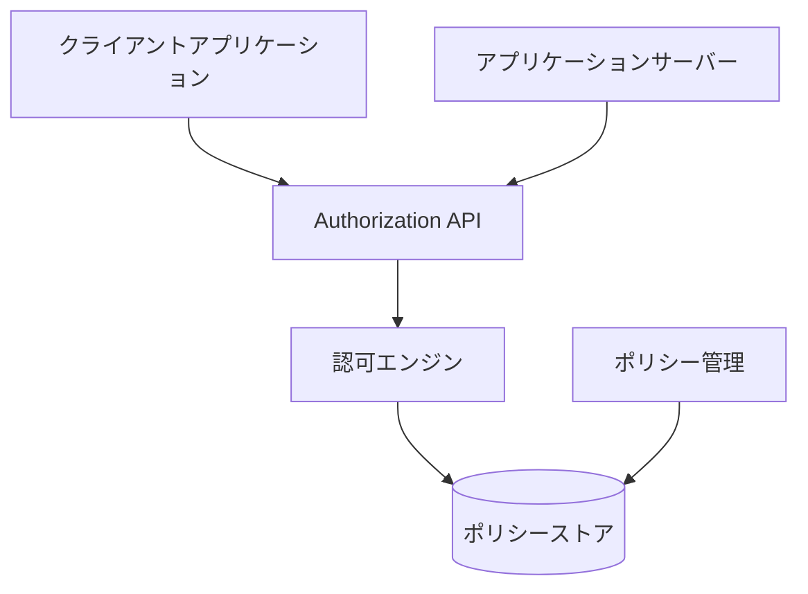
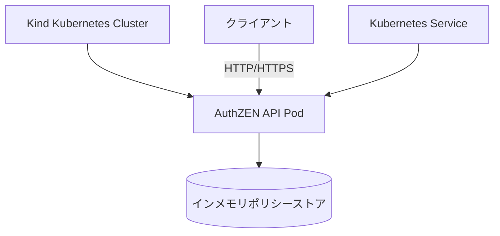
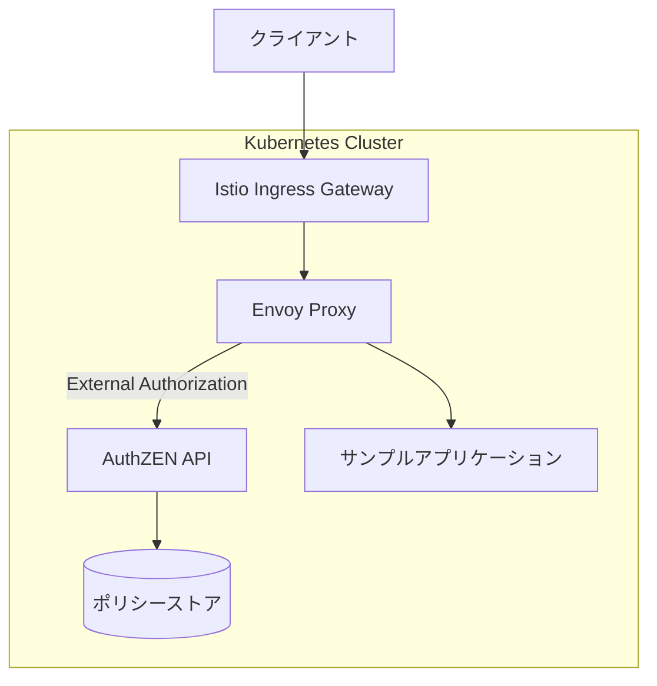

# AuthZEN

- [AuthZEN](#authzen)
  - [概要](#概要)
  - [AuthZENの説明](#authzenの説明)
    - [主な特徴](#主な特徴)
    - [基本概念](#基本概念)
    - [アーキテクチャ概要](#アーキテクチャ概要)
    - [認可フロー](#認可フロー)
  - [サンプルアプリケーションのKindへのデプロイと動作確認](#サンプルアプリケーションのkindへのデプロイと動作確認)
    - [要件](#要件)
    - [環境構築](#環境構築)
    - [サーバーのデプロイ](#サーバーのデプロイ)
      - [デプロイアーキテクチャ](#デプロイアーキテクチャ)
    - [動作確認](#動作確認)
    - [APIの仕様](#apiの仕様)
    - [Istio/Envoyとの統合](#istioenvoyとの統合)
      - [Istio統合アーキテクチャ](#istio統合アーキテクチャ)
    - [実装の構成](#実装の構成)
  - [詳細情報](#詳細情報)

## 概要

AuthZEN（Authorization API）は、認可APIの標準化を目指す取り組みです。このリポジトリでは、AuthZEN仕様に準拠した認可サーバーのサンプル実装と、Kubernetes（Kind）上での動作確認方法を提供しています。

## AuthZENの説明

AuthZEN（Authorization API）は、異なるシステム間で一貫した認可モデルを提供することを目的とした仕様です。

### 主な特徴

- **認可APIの標準化**: 異なるシステム間で一貫した認可インターフェースを提供
- **システム間の相互運用性**: 標準化されたAPIにより、異なる認可システム間の連携が容易に
- **拡張可能な属性モデル**: 様々なユースケースに対応できる柔軟な設計
- **様々な認可モデルのサポート**: RBAC、ABAC、ReBAC等の異なる認可モデルに対応

### 基本概念

AuthZEN APIは以下の基本概念に基づいています：

1. **Subject（主体）**: 認可判断の対象となるユーザーや機械プリンシパル
2. **Resource（リソース）**: アクセスされるリソース
3. **Action（アクション）**: リソースに対して実行される操作
4. **Context（コンテキスト）**: 環境や状況に関する追加情報

これらの要素を組み合わせて、「誰が」「何に対して」「どのような操作を」「どのような状況で」行えるかを判断します。

### アーキテクチャ概要



### 認可フロー

```
+------------+            +--------+                +----------+
|            |            |        |                |          |
| クライアント |            | アプリ  |                | AuthZEN  |
|            |            |        |                | API      |
+------------+            +--------+                +----------+
    |                         |                         |
    | 1. APIリクエスト          |                         |
    |------------------------>|                         |
    |                         |                         |
    |                         | 2. 認可リクエスト         |
    |                         |------------------------>|
    |                         |                         |
    |                         |                         |
    |                         |                         |
    |                         | 3. 認可決定              |
    |                         |<------------------------|
    |                         |                         |
    | 4. APIレスポンス          |                         |
    |<------------------------|                         |
    |                         |                         |
```

## サンプルアプリケーションのKindへのデプロイと動作確認

### 要件

- Authorization API Draft（AuthZEN）に準拠した認可サーバーを実装
- リクエストは `principal`, `resource`, `action` を含み、認可判定（Allow / Deny）を返す
- Kubernetes（Kind）上で動作するサンプル実装

### 環境構築

まず、必要なツールをインストールし、Kind（Kubernetes in Docker）クラスタを作成します。

```bash
# Kind クラスタの作成
kind create cluster --name authzen-sample

# クラスタの確認
kubectl cluster-info --context kind-authzen-sample
```

### サーバーのデプロイ

実装したAuthorization APIサーバーをKindにデプロイします：

```bash
# Kindクラスタへのデプロイ
cd authzen-api
./deploy-to-kind.sh
```

このスクリプトは、Dockerイメージをローカルでビルドし、Kindクラスタにロードします。

#### デプロイアーキテクチャ



### 動作確認

デプロイしたAPIサーバーに対して、認可リクエストを送信して動作を確認します。

```bash
# サービスのポートフォワード
kubectl port-forward svc/authzen-api 8080:8080

# 認可リクエストの送信
curl -X POST http://localhost:8080/v1/authorize \
  -H "Content-Type: application/json" \
  -d '{
    "principal": {"id": "user:alice"},
    "resource": {"id": "document:report"},
    "action": "read"
  }'
```

成功すると、以下のようなレスポンスが返ります：

```json
{
  "decision": "ALLOW"
}
```

または、アクセスが拒否された場合：

```json
{
  "decision": "DENY",
  "reason": "Access denied by policy"
}
```

### APIの仕様

サンプル実装では、以下のエンドポイントを提供しています：

1. **認可判定エンドポイント**
   - URL: `/v1/authorize`
   - メソッド: POST
   - リクエスト例:
     ```json
     {
       "principal": {"id": "user:alice"},
       "resource": {"id": "document:report"},
       "action": "read"
     }
     ```

2. **複数認可判定エンドポイント**
   - URL: `/v1/evaluations`
   - メソッド: POST
   - リクエスト例:
     ```json
     {
       "principal": {"id": "user:alice"},
       "evaluations": [
         {
           "resource": {"id": "document:report"},
           "action": "read"
         },
         {
           "resource": {"id": "document:budget"},
           "action": "write"
         }
       ]
     }
     ```

3. **検索エンドポイント**
   - Subject検索: `/v1/search/subject`
   - Resource検索: `/v1/search/resource`
   - Action検索: `/v1/search/action`

4. **ポリシー一覧エンドポイント**
   - URL: `/v1/policies`
   - メソッド: GET

5. **ヘルスチェックエンドポイント**
   - URL: `/health`
   - メソッド: GET

### Istio/Envoyとの統合

サンプル実装は、Istio Service MeshおよびEnvoyプロキシと統合することができます：

```bash
# Istio統合のデプロイ
cd authzen-api/kubernetes/istio-integration
./deploy-istio-integration.sh

# Istio Ingressゲートウェイへのポートフォワード
kubectl port-forward -n istio-system svc/istio-ingressgateway 8000:80

# 認可テスト
curl -H "x-user-id: user:alice" http://localhost:8000/sample
```

#### Istio統合アーキテクチャ



この統合により、サービスメッシュ内のすべてのリクエストに対して一貫した認可制御が可能になります。Envoyプロキシは、リクエストを処理する前にAuthZEN APIに認可判断を問い合わせます。

### 実装の構成

サンプル実装は、以下のディレクトリ構造で提供されています：

```
authzen-api/
├── Dockerfile                # Dockerイメージのビルド定義
├── go.mod                    # Goモジュール定義
├── go.sum                    # 依存関係のチェックサム
├── main.go                   # アプリケーションのエントリーポイント
├── api/
│   ├── server.go             # APIサーバーの実装
│   └── envoy_adapter.go      # Envoy外部認可アダプター
├── policy/
│   └── store.go              # ポリシーストアの実装
├── kubernetes/
│   ├── deployment.yaml       # Kubernetesデプロイメント定義
│   └── service.yaml          # Kubernetesサービス定義
├── deploy-to-kind.sh         # Kindクラスタへのデプロイスクリプト
└── client-example.sh         # クライアント例のスクリプト
```

## 詳細情報

サンプルアプリケーションのAuthZEN仕様への準拠状況と改善点については、[SPEC.md](SPEC.md)を参照してください。
