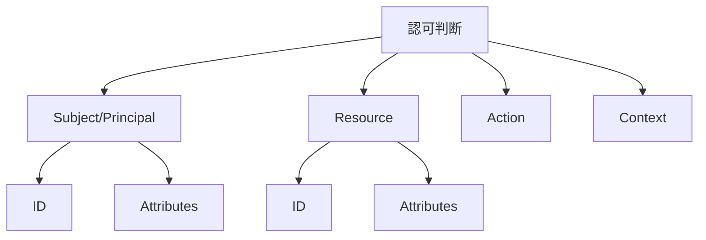
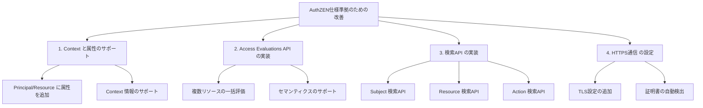

# AuthZEN sample application spec

- [AuthZEN sample application spec](#authzen-sample-application-spec)
  - [概要](#概要)
  - [AuthZEN仕様の主要要素](#authzen仕様の主要要素)
    - [情報モデルの概念図](#情報モデルの概念図)
    - [認可フロー](#認可フロー)
  - [サンプルアプリケーションの評価](#サンプルアプリケーションの評価)
    - [1. 情報モデル](#1-情報モデル)
      - [仕様要件](#仕様要件)
      - [実装状況](#実装状況)
    - [2. Access Evaluation API](#2-access-evaluation-api)
      - [仕様要件](#仕様要件-1)
      - [実装状況](#実装状況-1)
    - [3. Access Evaluations API](#3-access-evaluations-api)
      - [仕様要件](#仕様要件-2)
      - [実装状況](#実装状況-2)
    - [4. 検索API](#4-検索api)
      - [仕様要件](#仕様要件-3)
      - [実装状況](#実装状況-3)
    - [5. トランスポート](#5-トランスポート)
      - [仕様要件](#仕様要件-4)
      - [実装状況](#実装状況-4)
  - [総合評価](#総合評価)
  - [実装された改善点](#実装された改善点)
    - [1. Context と属性（attributes）のサポート](#1-context-と属性attributesのサポート)
    - [2. Access Evaluations API の実装](#2-access-evaluations-api-の実装)
    - [3. 検索API の実装](#3-検索api-の実装)
    - [4. HTTPS通信 の設定](#4-https通信-の設定)
  - [注意点](#注意点)

## 概要

このドキュメントでは、README.mdに記載されているサンプルアプリケーションがAuthZEN（Authorization API）仕様に準拠しているかどうかを評価します。

## AuthZEN仕様の主要要素

AuthZEN（Authorization API）仕様は、以下の主要要素で構成されています：

1. **情報モデル**：Subject（主体）、Resource（リソース）、Action（アクション）、Context（コンテキスト）
2. **Access Evaluation API**：単一の認可判断を行うAPI
3. **Access Evaluations API**：複数の認可判断を一度に行うAPI
4. **検索API**：Subject、Resource、Actionの検索を行うAPI
5. **トランスポート**：HTTPS通信の要件

### 情報モデルの概念図



### 認可フロー

```
+--------+                +--------+                +--------+
|        |                |        |                |        |
| クライアント |                | アプリ   |                | AuthZEN |
|        |                |        |                | API     |
+--------+                +--------+                +--------+
    |                         |                         |
    | 1. APIリクエスト         |                         |
    |------------------------>|                         |
    |                         |                         |
    |                         | 2. 認可リクエスト         |
    |                         |------------------------>|
    |                         |                         |
    |                         |                         |
    |                         |                         |
    |                         | 3. 認可決定              |
    |                         |<------------------------|
    |                         |                         |
    | 4. APIレスポンス         |                         |
    |<------------------------|                         |
    |                         |                         |
```

## サンプルアプリケーションの評価

### 1. 情報モデル

#### 仕様要件
AuthZEN仕様では、認可判断に必要な情報として以下の要素を定義しています：
- Subject（主体）：認可判断の対象となるユーザーや機械プリンシパル
- Resource（リソース）：アクセスされるリソース
- Action（アクション）：リソースに対して実行される操作
- Context（コンテキスト）：環境や状況に関する追加情報

#### 実装状況
サンプルアプリケーションでは、以下のように実装されています：

```go
// AuthorizeRequest は認可リクエストの構造を定義します
type AuthorizeRequest struct {
    Principal struct {
        ID string `json:"id"`
    } `json:"principal"`
    Resource struct {
        ID string `json:"id"`
    } `json:"resource"`
    Action string `json:"action"`
}
```

**評価**: 部分的に準拠
- Principal（Subject）、Resource、Actionの基本要素は実装されています
- しかし、Contextの実装が不足しています
- また、仕様で定義されている属性（attributes）のサポートが限定的です

### 2. Access Evaluation API

#### 仕様要件
AuthZEN仕様では、単一の認可判断を行うためのAPIエンドポイントを定義しています。このAPIは、Subject、Resource、Action、Contextを含むリクエストを受け取り、許可/拒否の判断を返します。

#### 実装状況
サンプルアプリケーションでは、`/v1/authorize`エンドポイントを実装しています：

```go
// handleAuthorize は認可リクエストを処理します
func (s *Server) handleAuthorize(w http.ResponseWriter, r *http.Request) {
    var req AuthorizeRequest
    if err := json.NewDecoder(r.Body).Decode(&req); err != nil {
        http.Error(w, "Invalid request body", http.StatusBadRequest)
        return
    }

    // ポリシーの評価
    allowed := s.store.CheckPolicy(req.Principal.ID, req.Resource.ID, req.Action)

    // レスポンスの作成
    resp := AuthorizeResponse{}
    if allowed {
        resp.Decision = "ALLOW"
    } else {
        resp.Decision = "DENY"
        resp.Reason = "Access denied by policy"
    }

    // レスポンスの送信
    w.Header().Set("Content-Type", "application/json")
    json.NewEncoder(w).Encode(resp)
}
```

**評価**: 部分的に準拠
- 基本的な認可判断の機能は実装されています
- レスポンス形式は仕様に近いですが、完全には一致していません
- Contextのサポートが不足しています

### 3. Access Evaluations API

#### 仕様要件
AuthZEN仕様では、複数の認可判断を一度に行うためのAPIエンドポイントを定義しています。

#### 実装状況
サンプルアプリケーションでは、複数の認可判断を一度に行うAPIエンドポイントは実装されていません。

**評価**: 未対応
- Access Evaluations APIは実装されていません

### 4. 検索API

#### 仕様要件
AuthZEN仕様では、Subject、Resource、Actionの検索を行うためのAPIエンドポイントを定義しています。

#### 実装状況
サンプルアプリケーションでは、ポリシー一覧を取得するエンドポイント（`/v1/policies`）は実装されていますが、仕様で定義されている検索APIは実装されていません。

**評価**: 未対応
- Subject Search API、Resource Search API、Action Search APIは実装されていません

### 5. トランスポート

#### 仕様要件
AuthZEN仕様では、HTTPS通信を使用することを要求しています。

#### 実装状況
サンプルアプリケーションでは、HTTPSの設定は明示的に行われていませんが、Kubernetesデプロイメントでは対応可能です。

**評価**: 部分的に準拠
- 基本的なHTTP通信は実装されていますが、TLS/SSLの設定は明示的に行われていません

## 総合評価

サンプルアプリケーションは、AuthZEN仕様の基本的な概念（Subject/Principal、Resource、Action）と基本的な認可判断の機能を実装していました。しかし、いくつかの点で仕様に完全には準拠していなかったため、以下の改善を行いました：

1. **Context**のサポートを追加しました
2. **属性（attributes）**のサポートを追加しました
3. **Access Evaluations API**を実装しました
4. **検索API**（Subject、Resource、Action）を実装しました
5. **HTTPS通信**の設定を追加しました

## 実装された改善点

以下の図は、サンプルアプリケーションに対して行った改善点の概要を示しています：



### 1. Context と属性（attributes）のサポート

AuthorizeRequestに Context と属性（attributes）のサポートを追加しました：

```go
// AuthorizeRequest は認可リクエストの構造を定義します
type AuthorizeRequest struct {
    Principal struct {
        ID         string                 `json:"id"`
        Attributes map[string]interface{} `json:"attributes,omitempty"`
    } `json:"principal"`
    Resource struct {
        ID         string                 `json:"id"`
        Attributes map[string]interface{} `json:"attributes,omitempty"`
    } `json:"resource"`
    Action  string                 `json:"action"`
    Context map[string]interface{} `json:"context,omitempty"`
}
```

### 2. Access Evaluations API の実装

複数の認可判断を一度に行うためのAPIを実装しました：

```go
// EvaluationsRequest は複数の認可リクエストの構造を定義します
type EvaluationsRequest struct {
    Principal struct {
        ID         string                 `json:"id"`
        Attributes map[string]interface{} `json:"attributes,omitempty"`
    } `json:"principal"`
    Context     map[string]interface{} `json:"context,omitempty"`
    Action      string                 `json:"action,omitempty"`
    Evaluations []struct {
        Resource struct {
            ID         string                 `json:"id"`
            Attributes map[string]interface{} `json:"attributes,omitempty"`
        } `json:"resource"`
        Action string `json:"action,omitempty"`
    } `json:"evaluations"`
    Semantic string `json:"semantic,omitempty"` // permit_overrides, deny_overrides, permit_on_first_permit, deny_on_first_deny
}

// EvaluationsResponse は複数の認可レスポンスの構造を定義します
type EvaluationsResponse struct {
    Evaluations []struct {
        Decision string                 `json:"decision"`
        Reason   string                 `json:"reason,omitempty"`
        Context  map[string]interface{} `json:"context,omitempty"`
    } `json:"evaluations"`
}

// handleEvaluations は複数の認可リクエストを処理します
func (s *Server) handleEvaluations(w http.ResponseWriter, r *http.Request) {
    // 実装内容
}
```

また、APIルーターに新しいエンドポイントを追加しました：

```go
// 複数認可エンドポイント
r.HandleFunc("/v1/evaluations", s.handleEvaluations).Methods("POST")
```

### 3. 検索API の実装

Subject、Resource、Actionの検索を行うためのAPIを実装しました：

```go
// 検索エンドポイント
r.HandleFunc("/v1/search/subject", s.handleSearchSubject).Methods("POST")
r.HandleFunc("/v1/search/resource", s.handleSearchResource).Methods("POST")
r.HandleFunc("/v1/search/action", s.handleSearchAction).Methods("POST")
```

各検索APIには、対応するリクエスト/レスポンス構造体とハンドラー関数を実装しました。

### 4. HTTPS通信 の設定

HTTPS通信をサポートするために、TLS設定を追加しました：

```go
// HTTPSサーバーの設定
httpServer := &http.Server{
    Addr:    fmt.Sprintf(":%d", port),
    Handler: server.Router(),
    TLSConfig: &tls.Config{
        MinVersion: tls.VersionTLS12,
    },
}

// 証明書ファイルの存在確認
_, certErr := os.Stat("server.crt")
_, keyErr := os.Stat("server.key")

// サーバーの起動（証明書がある場合はHTTPS、ない場合はHTTP）
if os.IsNotExist(certErr) || os.IsNotExist(keyErr) {
    log.Printf("証明書ファイルが見つかりません。HTTP Authorization APIサーバーを起動しています。ポート: %d", port)
    log.Printf("注意: 本番環境ではHTTPSを使用してください。")
    err := httpServer.ListenAndServe()
    // エラー処理
} else {
    log.Printf("HTTPS Authorization APIサーバーを起動しています。ポート: %d", port)
    err := httpServer.ListenAndServeTLS("server.crt", "server.key")
    // エラー処理
}
```

## 注意点

1. このサンプルアプリケーションは、AuthZEN仕様の基本概念を示すための簡易的な実装であり、本番環境での使用を意図したものではありません。

2. 完全な仕様準拠を目指す場合は、より詳細な実装が必要です。特に以下の点に注意が必要です：
   - 複雑な認可ロジックのサポート
   - 大規模なポリシーデータの効率的な管理
   - パフォーマンスとスケーラビリティの最適化
   - セキュリティ強化（認証との連携、監査ログなど）

3. AuthZEN仕様は現在もドラフト段階であり、今後変更される可能性があります。実装を行う際は、最新の仕様を参照することをお勧めします。
