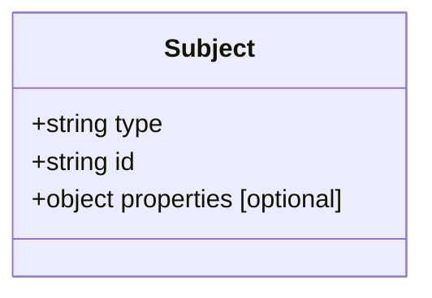
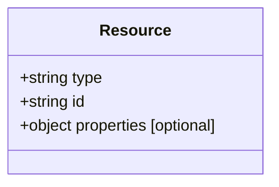
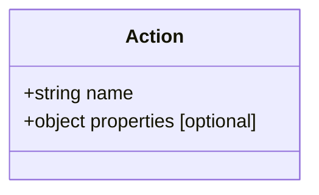

# AuthZEN API 仕様詳細

このドキュメントでは、AuthZEN（Authorization API）の詳細な仕様について説明します。

## 目次

- [情報モデル](#情報モデル)
- [Access Evaluation API](#access-evaluation-api)
- [Access Evaluations API](#access-evaluations-api)
- [検索API](#検索api)
- [メタデータディスカバリー](#メタデータディスカバリー)
- [エラーハンドリング](#エラーハンドリング)

## 情報モデル

AuthZENの情報モデルは以下の要素で構成されています：

### Subject（主体）



Subjectは以下の属性を持ちます：

- `type`: **必須**。主体の種類を指定する文字列値。
- `id`: **必須**。`type`の範囲内で一意の主体識別子を含む文字列値。
- `properties`: **オプション**。主体の追加プロパティを表すJSONオブジェクト。

#### Subject Properties（主体のプロパティ）

多くの認可システムはステートレスであり、クライアント（PEP）が認可ポリシーの評価に使用される属性を渡すことを期待しています。この要件を満たすために、Subjectは`properties`オブジェクトの下に0個以上の追加属性をキーと値のペアとして含むことができます。

属性は単一値または複数値を持つことができます。また、プリミティブ型（文字列、ブール値、数値）または複合型（JSONオブジェクトやJSONの配列）にすることができます。

##### 共通プロパティ

相互運用性を高めるために、いくつかの共通プロパティが指定されています：

###### IPアドレス

Subjectの IPアドレスは、`ip_address`フィールドで識別され、その値はRFC4001で定義されているIPアドレスのテキスト表現です。

###### デバイスID

SubjectのデバイスIDは、`device_id`フィールドで識別され、その値はデバイス識別子の文字列表現です。

### Resource（リソース）



Resourceは以下の属性を持ちます：

- `type`: **必須**。リソースの種類を指定する文字列値。
- `id`: **必須**。`type`の範囲内で一意のリソース識別子を含む文字列値。
- `properties`: **オプション**。リソースの追加プロパティを表すJSONオブジェクト。

### Action（アクション）



Actionは以下の属性を持ちます：

- `name`: **必須**。アクションの名前。
- `properties`: **オプション**。アクションの追加プロパティを表すJSONオブジェクト。

### Context（コンテキスト）

Contextオブジェクトは、リクエストに関する環境やコンテキストデータを表す属性のセットです。これはJSONオブジェクトです。

## Access Evaluation API

Access Evaluation APIは、クライアント（PEP）と認可サービス（PDP）間のメッセージ交換パターンを定義し、単一のアクセス評価を実行します。

### リクエスト

Access Evaluationリクエストは、前述の4つのエンティティで構成される4タプルです：

- `subject`: **必須**。Subject型の主体（またはプリンシパル）。
- `action`: **必須**。Action型のアクション（または動詞）。
- `resource`: **必須**。Resource型のリソース。
- `context`: **オプション**。Context型のコンテキスト（または環境）。

```
POST /access/v1/evaluation HTTP/1.1
Host: pdp.mycompany.com
Authorization: Bearer <myoauthtoken>
X-Request-ID: bfe9eb29-ab87-4ca3-be83-a1d5d8305716

{
  "subject": {
    "type": "user",
    "id": "alice@acmecorp.com"
  },
  "resource": {
    "type": "document",
    "id": "123"
  },
  "action": {
    "name": "read"
  },
  "context": {
    "time": "2024-10-26T01:22-07:00"
  }
}
```

### レスポンス

レスポンスの最も単純な形式は、決定を表すブール値で、`"decision"`フィールドで示されます。

- `decision`: **必須**。操作を許可するか拒否するかを指定するブール値。

この仕様では、評価が成功した場合、以下の2つの可能なレスポンスがあります：

- `true`: アクセスリクエストは許可されます。
- `false`: アクセスリクエストは拒否され、許可されてはなりません。

```
HTTP/1.1 OK
Content-type: application/json
X-Request-ID: bfe9eb29-ab87-4ca3-be83-a1d5d8305716

{
  "decision": true
}
```

#### レスポンスの追加コンテキスト

`"decision"`に加えて、レスポンスには任意のJSONオブジェクトである`"context"`フィールドを含めることができます。このコンテキストは、決定評価プロセスの一部としてPEPが使用できる追加情報を伝えることができます。例としては以下があります：

- XACMLの「アドバイス」と「義務」の概念
- UI状態のレンダリングのためのヒント
- ステップアップ認証の指示

## Access Evaluations API

Access Evaluations APIは、クライアント（PEP）と認可サービス（PDP）間のメッセージ交換パターンを定義し、単一のメッセージ交換の範囲内で複数のアクセス評価を評価します（「ボックスカー」リクエストとも呼ばれます）。

### リクエスト

複数のアクセス評価リクエストを単一のメッセージで送信するために、呼び出し元はリクエストに`evaluations`キーを追加できます。`evaluations`キーは、Access Evaluation Requestで定義された4タプルとして型付けされた各JSONオブジェクトを含む配列です。

```
POST /access/v1/evaluations HTTP/1.1
Host: pdp.mycompany.com
Authorization: Bearer <myoauthtoken>
X-Request-ID: bfe9eb29-ab87-4ca3-be83-a1d5d8305716

{
  "subject": {
    "type": "user",
    "id": "alice@acmecorp.com"
  },
  "context": {
    "time": "2024-05-31T15:22-07:00"
  },
  "action": {
    "name": "read"
  },
  "evaluations": [
    {
      "resource": {
        "type": "document",
        "id": "boxcarring.md"
      }
    },
    {
      "resource": {
        "type": "document",
        "id": "subject-search.md"
      }
    },
    {
      "action": {
        "name": "edit"
      },
      "resource": {
        "type": "document",
        "id": "resource-search.md"
      }
    }
  ]
}
```

#### デフォルト値

トップレベルの`subject`、`action`、`resource`、`context`キーのいずれかが提供されている場合、トップレベルキーの値は`evaluations`配列で指定された4タプルのデフォルト値として扱われます。`evaluations`配列に存在する4タプルでトップレベルキーが指定されている場合、その値はこれらのデフォルト値よりも優先されます。

#### 評価オプション

`evaluations`リクエストペイロードには、キーと値のペアのセットを含むJSON値を持つオプションの`options`キーが含まれています。

これは、リクエストの実行方法に関する呼び出し元が提供するメタデータを提供するための汎用メカニズムです。

そのようなオプションの1つは*評価セマンティクス*を制御し、以下で説明されています。

##### 評価セマンティクス

デフォルトでは、`evaluations`配列内のすべてのリクエストが実行され、同じ配列順序でレスポンスが返されます。これは、単一のペイロードで複数の評価リクエストをボックスカーする最も一般的なユースケースです。

3つの評価セマンティクスがサポートされています：

1. *すべてのリクエストを実行し（潜在的に並行して）、すべての結果を返します。* 失敗は`decision: false`で示され、コンテキストに理由コードを提供する場合があります。
2. *最初の拒否（または失敗）で拒否します。* このセマンティクスは、PEPが特定の順序でいくつかのリクエストを発行し、拒否（エラー、または`decision: false`）が評価呼び出しを「ショートサーキット」し、最初の拒否で返すことを望む場合に望ましい場合があります。これは本質的にプログラミング言語の`&&`演算子のように機能します。
3. *最初の許可で許可します。* これは逆の「ショートサーキット」セマンティクスであり、プログラミング言語の`||`演算子のように機能します。

希望する評価セマンティクスを選択するために、呼び出し元は`options.evaluations_semantic`を以下の値のいずれかと共に渡すことができます：

  * `execute_all`
  * `deny_on_first_deny`
  * `permit_on_first_permit`

`execute_all`はデフォルトのセマンティクスであるため、`options.evaluations_semantic`フラグのない`evaluations`リクエストはこのセマンティクスを使用して実行されます。

### レスポンス

リクエスト形式と同様に、Access Evaluations Responseの形式は、リクエストの`evaluations`配列で提供されたのと同じ順序で決定をリストする`evaluations`配列を追加します。evaluations配列の各値は、Access Evaluation Responseとして型付けされています。

```
HTTP/1.1 OK
Content-type: application/json
X-Request-ID: bfe9eb29-ab87-4ca3-be83-a1d5d8305716

{
  "evaluations": [
    {
      "decision": true
    },
    {
      "decision": false,
      "context": {
        "error": {
          "status": 404,
          "message": "Resource not found"
        }
      }
    },
    {
      "decision": false,
      "context": {
        "reason": "Subject is a viewer of the resource"
      }
    }
  ]
}
```

## 検索API

### Subject Search API

Subject Search APIは、クライアント（PEP）と認可サービス（PDP）間のメッセージ交換パターンを定義し、検索条件に一致するすべての主体を返します。

#### リクエスト

Subject Searchリクエストは、前述の3つのエンティティで構成される4タプルです：

- `subject`: **必須**。Subject型の主体（またはプリンシパル）。注意：Subject型は必須ですが、Subject IDは省略でき、存在する場合は無視されます。
- `action`: **必須**。Action型のアクション（または動詞）。
- `resource`: **必須**。Resource型のリソース。
- `context`: **オプション**。リクエストに関するコンテキストデータ。
- `page`: **オプション**。ページングされたリクエストのページトークン。

```
POST /access/v1/search/subject HTTP/1.1
Host: pdp.mycompany.com
Authorization: Bearer <myoauthtoken>
X-Request-ID: bfe9eb29-ab87-4ca3-be83-a1d5d8305716

{
  "subject": {
    "type": "user"
  },
  "action": {
    "name": "read"
  },
  "resource": {
    "type": "account",
    "id": "123"
  },
  "context": {
    "time": "2024-10-26T01:22-07:00"
  }
}
```

#### レスポンス

レスポンスはページングされたSubjectの配列です。

```
HTTP/1.1 OK
Content-type: application/json
X-Request-ID: bfe9eb29-ab87-4ca3-be83-a1d5d8305716

{
  "results": [
    {
      "type": "user",
      "id": "alice@acmecorp.com"
    },
    {
      "type": "user",
      "id": "bob@acmecorp.com"
    }
  ],
  "page": {
    "next_token": "alsehrq3495u8"
  }
}
```

### Resource Search API

Resource Search APIは、クライアント（PEP）と認可サービス（PDP）間のメッセージ交換パターンを定義し、検索条件に一致するすべてのリソースを返します。

#### リクエスト

Resource Searchリクエストは、前述の3つのエンティティで構成される4タプルです：

- `subject`: **必須**。Subject型の主体（またはプリンシパル）。
- `action`: **必須**。Action型のアクション（または動詞）。
- `resource`: **必須**。Resource型のリソース。注意：Resource型は必須ですが、Resource IDは省略され、存在する場合は無視されます。
- `context`: **オプション**。リクエストに関するコンテキストデータ。
- `page`: **オプション**。ページングされたリクエストのページトークン。

```
POST /access/v1/search/resource HTTP/1.1
Host: pdp.mycompany.com
Authorization: Bearer <myoauthtoken>
X-Request-ID: bfe9eb29-ab87-4ca3-be83-a1d5d8305716

{
  "subject": {
    "type": "user",
    "id": "alice@acmecorp.com"
  },
  "action": {
    "name": "read"
  },
  "resource": {
    "type": "account"
  }
}
```

#### レスポンス

レスポンスはページングされたResourceの配列です。

```
HTTP/1.1 OK
Content-type: application/json
X-Request-ID: bfe9eb29-ab87-4ca3-be83-a1d5d8305716

{
  "results": [
    {
      "type": "account",
      "id": "123"
    },
    {
      "type": "account",
      "id": "456"
    }
  ],
  "page": {
    "next_token": "alsehrq3495u8"
  }
}
```

### Action Search API

Action Search APIは、クライアント（PEP）と認可サービス（PDP）間のメッセージ交換パターンを定義し、検索条件に一致するすべてのアクションを返します。

#### リクエスト

Action Searchリクエストは、前述の3つのエンティティで構成される3タプルです：

- `subject`: **必須**。Subject型の主体（またはプリンシパル）。
- `resource`: **必須**。Resource型のリソース。
- `context`: **オプション**。リクエストに関するコンテキストデータ。
- `page`: **オプション**。ページングされたリクエストのページトークン。

```
POST /access/v1/search/action HTTP/1.1
Host: pdp.mycompany.com
Authorization: Bearer <myoauthtoken>
X-Request-ID: bfe9eb29-ab87-4ca3-be83-a1d5d8305716

{
  "subject": {
    "type": "user",
    "id": "alice@acmecorp.com"
  },
  "resource": {
    "type": "account",
    "id": "123"
  },
  "context": {
    "time": "2024-10-26T01:22-07:00"
  }
}
```

#### レスポンス

レスポンスはページングされたActionの配列です。

```
HTTP/1.1 OK
Content-type: application/json
X-Request-ID: bfe9eb29-ab87-4ca3-be83-a1d5d8305716

{
  "results": [
    {
      "name": "read"
    },
    {
      "name": "write"
    }
  ],
  "page": {
    "next_token": "alsehrq3495u8"
  }
}
```

## メタデータディスカバリー

Policy Decision Pointはその設定を記述するメタデータを持つことができます。

### データ構造

以下のPolicy Decision Pointメタデータパラメータがこの仕様で使用されます：

#### エンドポイントパラメータ

- `policy_decision_point`: **必須**。PDPのポリシー決定ポイント識別子。これは「https」スキームを使用し、クエリやフラグメントコンポーネントを持たないURLです。
- `access_evaluation_endpoint`: **必須**。PDPのAccess Evaluation APIエンドポイントのURL。
- `access_evaluations_endpoint`: **オプション**。PDPのAccess Evaluations APIエンドポイントのURL。
- `search_subject_endpoint`: **オプション**。主体要素に基づくPDPの検索APIエンドポイントのURL。
- `search_action_endpoint`: **オプション**。アクション要素に基づくPDPの検索APIエンドポイントのURL。
- `search_resource_endpoint`: **オプション**。リソース要素に基づくPDPの検索APIエンドポイントのURL。

### メタデータの取得

メタデータをサポートするPDPは、以下のURLでメタデータを含むJSONドキュメントを利用可能にする必要があります：

```
/.well-known/authzen-configuration
```

#### メタデータリクエスト

PDPメタデータドキュメントは、前述のURLでHTTP GETリクエストを使用してクエリする必要があります。リソース識別子がhttps://pdp.mycompany.comの場合、メタデータのコンシューマーは以下のリクエストを行います：

```
GET /.well-known/authzen-configuration HTTP/1.1
Host: pdp.mycompany.com
```

#### メタデータレスポンス

レスポンスは、保護されたリソースの設定に関するメタデータパラメータのセットです。成功したレスポンスは`200 OK HTTP`ステータスコードを使用し、`application/json`コンテンツタイプを使用してJSONオブジェクトを返す必要があります。

```
HTTP/1.1 200 OK
Content-Type: application/json

{
  "policy_decision_point": "https://pdp.mycompany.com",
  "access_evaluation_endpoint": "https://pdp.mycompany.com/access/v1/evaluation",
  "search_subject_endpoint": "https://pdp.mycompany.com/access/v1/search/subject",
  "search_resource_endpoint": "https://pdp.mycompany.com/access/v1/search/resource"
}
```

## エラーハンドリング

以下のエラーレスポンスは、Authorization APIのすべてのメソッドに共通です。エラーレスポンスは、エラーを示すHTTPSステータスコードによって示されます。

以下のエラーは、以下で定義されたステータスコードによって示されます：

| コード | 説明 | HTTPSボディコンテンツ |
|------|--------------|-------------------|
| 400  | Bad Request  | エラーメッセージ文字列 |
| 401  | Unauthorized | エラーメッセージ文字列 |
| 403  | Forbidden    | エラーメッセージ文字列 |
| 500  | Internal error | エラーメッセージ文字列 |

注意：HTTPSエラーはPDPによって返され、リクエストまたはその処理に関連するエラー条件を示し、認可決定の結果とは無関係です。認可決定の結果は常に`200`ステータスコードとレスポンスペイロードで返されます。

具体的には：

- `401` HTTPSステータスコードは、呼び出し元（ポリシー実施ポイント）がPDPに適切に認証しなかったことを示します - 例えば、必要な`Authorization`ヘッダーを省略したり、無効なアクセストークンを使用したりした場合。
- PDPは、`200` HTTPSステータスコードと`{ "decision": false }`のペイロードを持つレスポンスを送信することにより、認可リクエストが拒否されたことを呼び出し元に示します。

### リクエスト識別

APIへのすべてのリクエストには、それらを一意に識別するためのリクエスト識別子がある場合があります。APIクライアント（PEP）はリクエスト識別子の生成を担当します。存在する場合、リクエスト識別子はHTTPSヘッダー`X-Request-ID`を使用して提供されます。このヘッダーの値は任意の文字列です。

```
POST /access/v1/evaluation HTTP/1.1
Authorization: Bearer mF_9.B5f-4.1JqM
X-Request-ID: bfe9eb29-ab87-4ca3-be83-a1d5d8305716
```

### レスポンスでのリクエスト識別

`X-Request-ID`ヘッダーを含むAuthorization APIリクエストに応答するPDPは、レスポンスにリクエスト識別子を含める必要があります。リクエスト識別子はHTTPSレスポンスヘッダー：`X-Request-ID`で指定されます。PEPがリクエストでリクエスト識別子を指定した場合、PDPはそのリクエストへのレスポンスに同じ識別子を含める必要があります。

```
HTTP/1.1 OK
Content-type: application/json
X-Request-ID: bfe9eb29-ab87-4ca3-be83-a1d5d8305716
