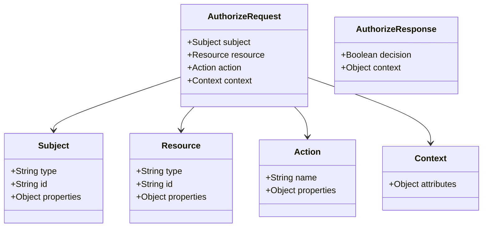
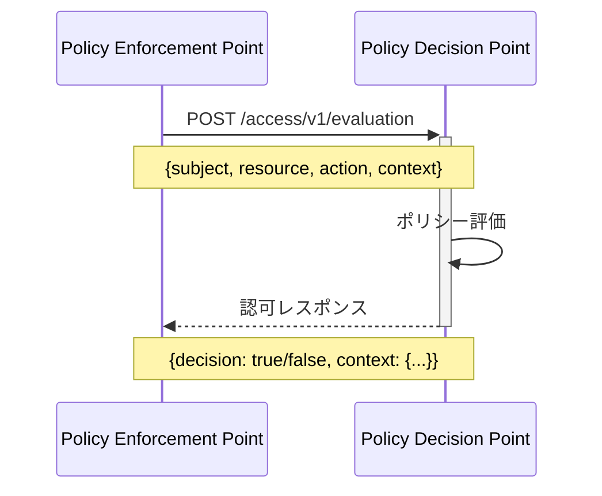
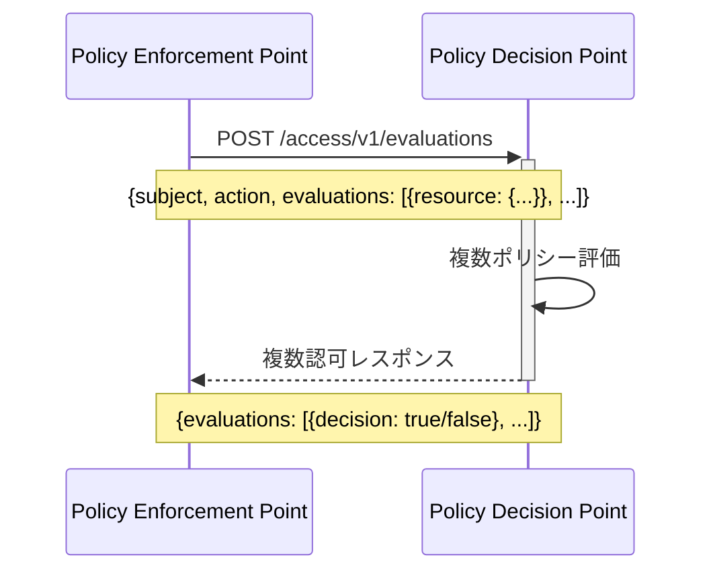
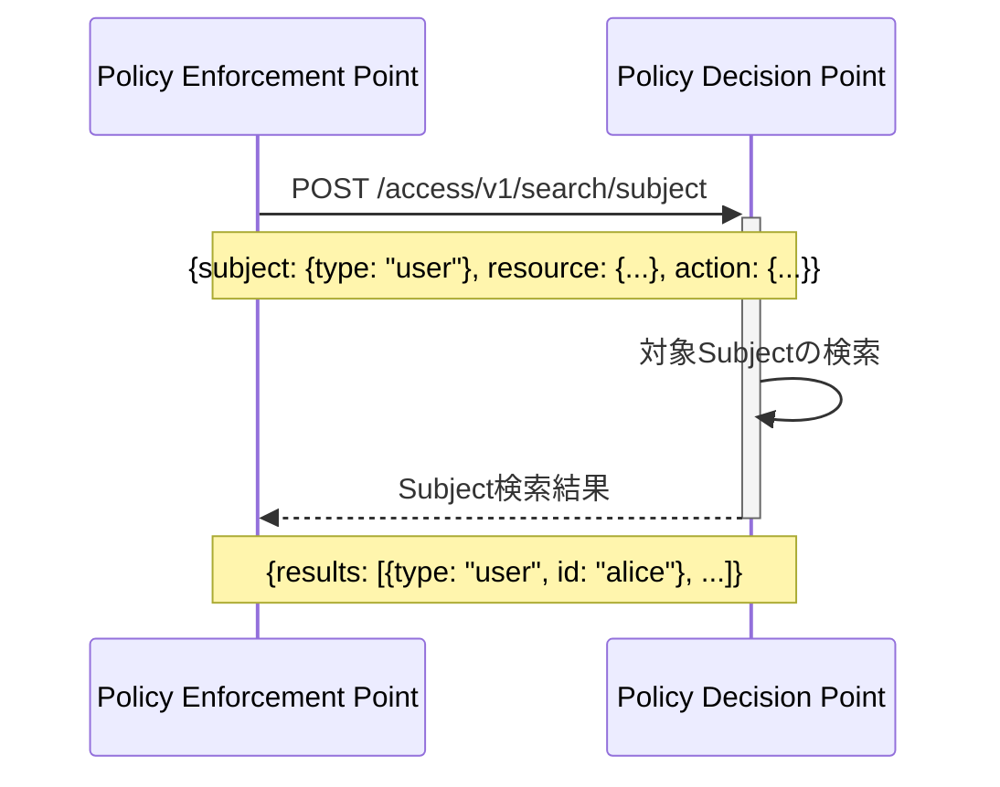
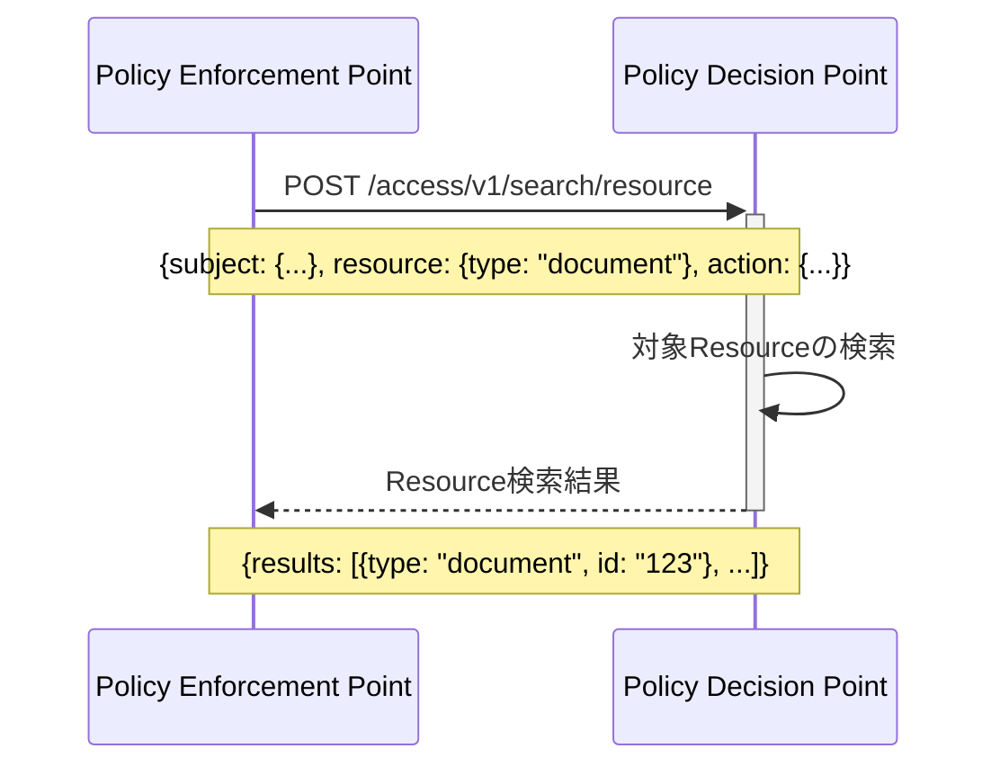
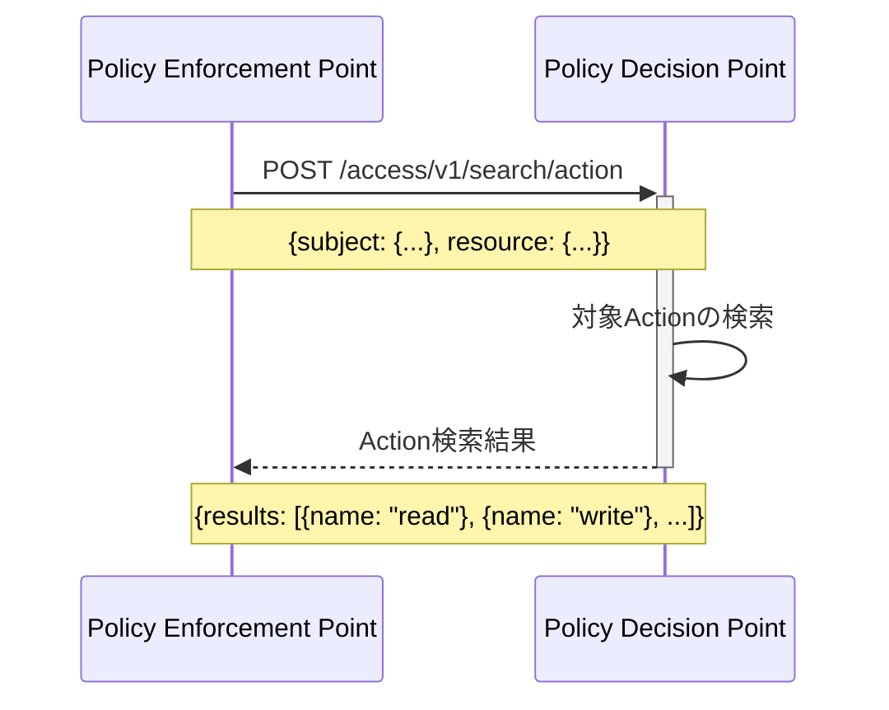
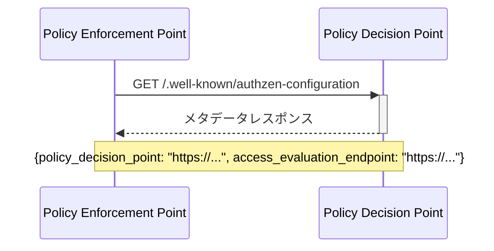

# AuthZEN アーキテクチャ図

このドキュメントでは、AuthZEN（Authorization API）の主要なアーキテクチャコンポーネントと情報フローを図で説明します。

## 1. 基本アーキテクチャ

AuthZENは、Policy Decision Point（PDP）とPolicy Enforcement Point（PEP）間の通信を標準化するためのAPIです。

```mermaid
flowchart LR
    subgraph "アプリケーション"
        PEP["Policy Enforcement Point\n(PEP)"]
    end
    
    subgraph "認可サービス"
        PDP["Policy Decision Point\n(PDP)"]
        PS["ポリシーストア"]
    end
    
    User["ユーザー"] -->|1. リソースにアクセス| PEP
    PEP -->|2. 認可リクエスト| PDP
    PDP -->|3. ポリシー評価| PS
    PS -->|4. 評価結果| PDP
    PDP -->|5. 認可レスポンス\n(許可/拒否)| PEP
    PEP -->|6. アクセス許可/拒否| User
```

## 2. 情報モデル

AuthZENの情報モデルは、Subject（主体）、Resource（リソース）、Action（アクション）、Context（コンテキスト）の4つの主要エンティティで構成されています。



## 3. Access Evaluation API フロー

単一の認可判断を行うためのAPIフローです。



## 4. Access Evaluations API フロー（複数リクエスト）

複数の認可判断を一度に行うためのAPIフローです（boxcarring）。



## 5. 検索API フロー

### 5.1 Subject Search API

特定のリソースとアクションに対して許可されているSubjectを検索するAPIフローです。



### 5.2 Resource Search API

特定のSubjectとアクションに対して許可されているResourceを検索するAPIフローです。



### 5.3 Action Search API

特定のSubjectとResourceに対して許可されているActionを検索するAPIフローです。



## 6. メタデータディスカバリー

PDPのメタデータを取得するためのAPIフローです。



## 7. 評価セマンティクス

Access Evaluations APIでサポートされている3つの評価セマンティクスを示します。

```mermaid
flowchart TD
    Start([開始]) --> Semantic{評価セマンティクス}
    
    Semantic -->|execute_all| ExecuteAll[すべてのリクエストを実行]
    ExecuteAll --> AllResults[すべての結果を返す]
    
    Semantic -->|deny_on_first_deny| DenyFirst[順番に実行]
    DenyFirst --> DenyCheck{拒否あり?}
    DenyCheck -->|Yes| StopDeny[実行停止]
    DenyCheck -->|No| ContinueDeny[次のリクエスト]
    ContinueDeny --> DenyCheck
    StopDeny --> ReturnDeny[拒否までの結果を返す]
    
    Semantic -->|permit_on_first_permit| PermitFirst[順番に実行]
    PermitFirst --> PermitCheck{許可あり?}
    PermitCheck -->|Yes| StopPermit[実行停止]
    PermitCheck -->|No| ContinuePermit[次のリクエスト]
    ContinuePermit --> PermitCheck
    StopPermit --> ReturnPermit[許可までの結果を返す]
    
    AllResults --> End([終了])
    ReturnDeny --> End
    ReturnPermit --> End
