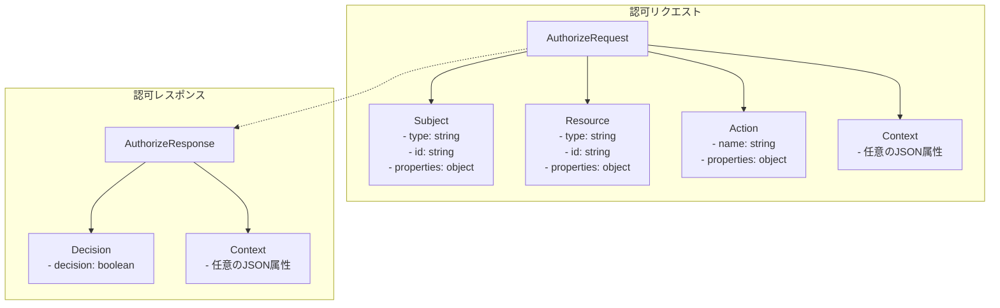
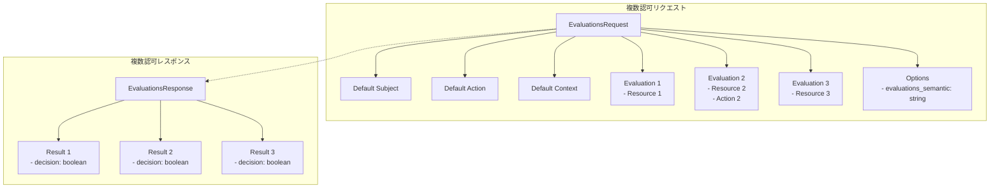
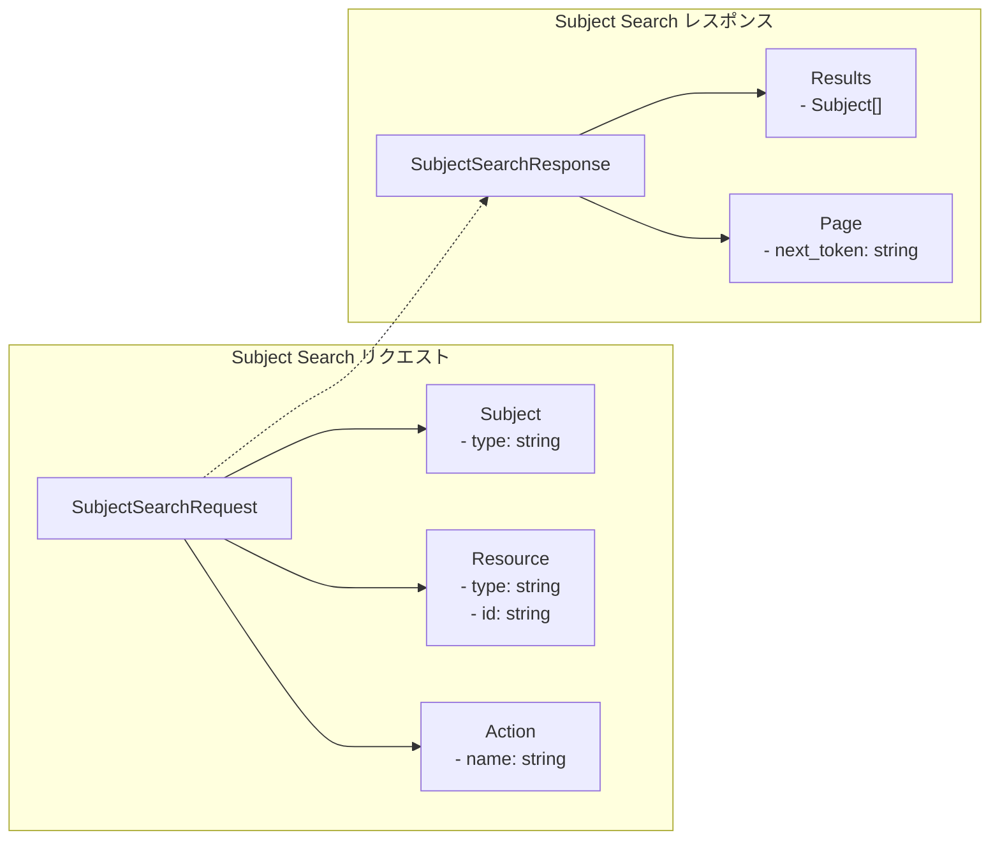
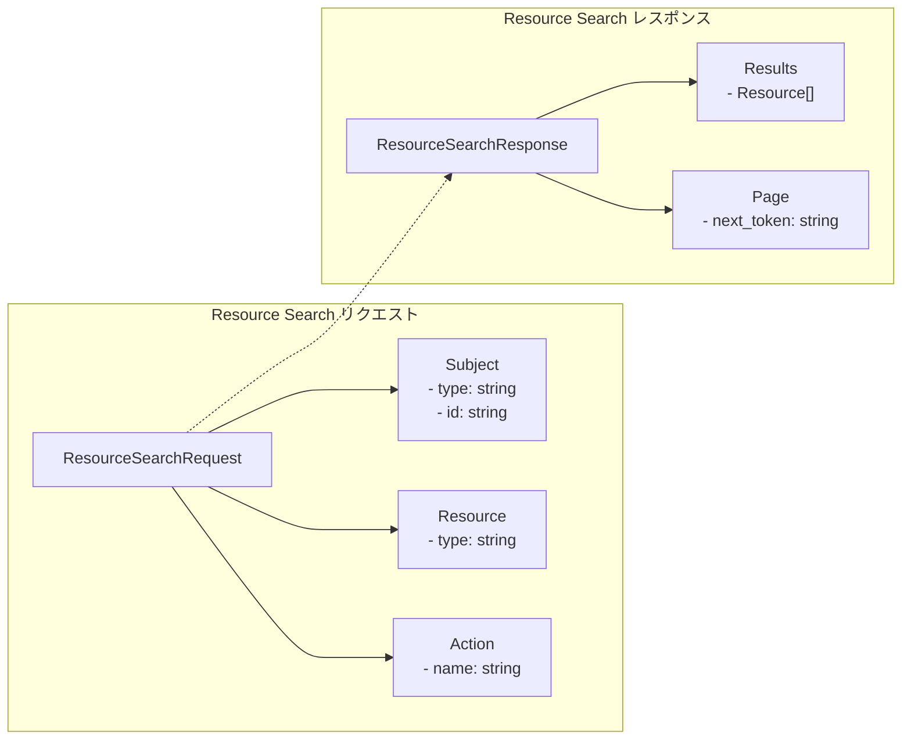
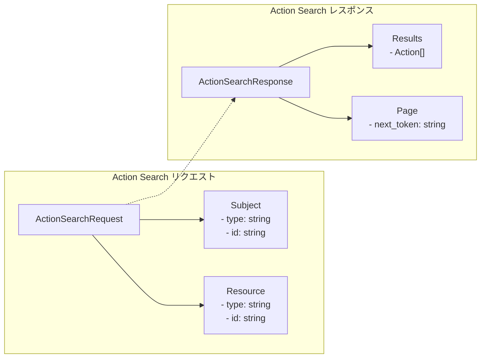
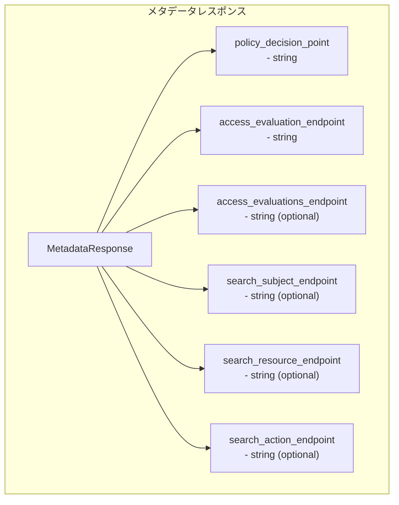
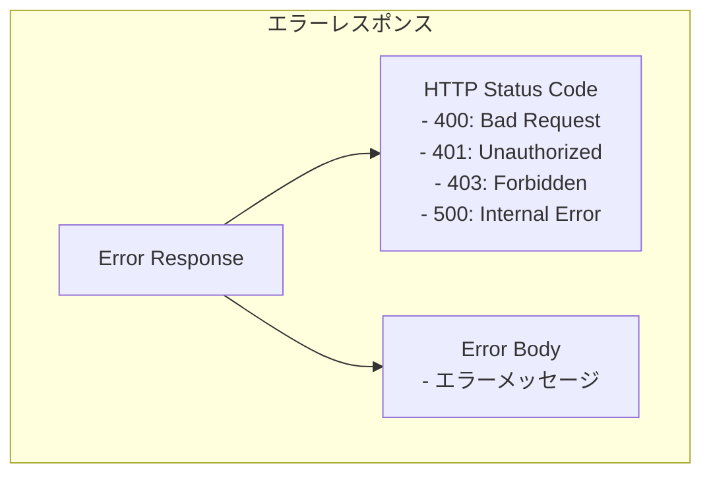
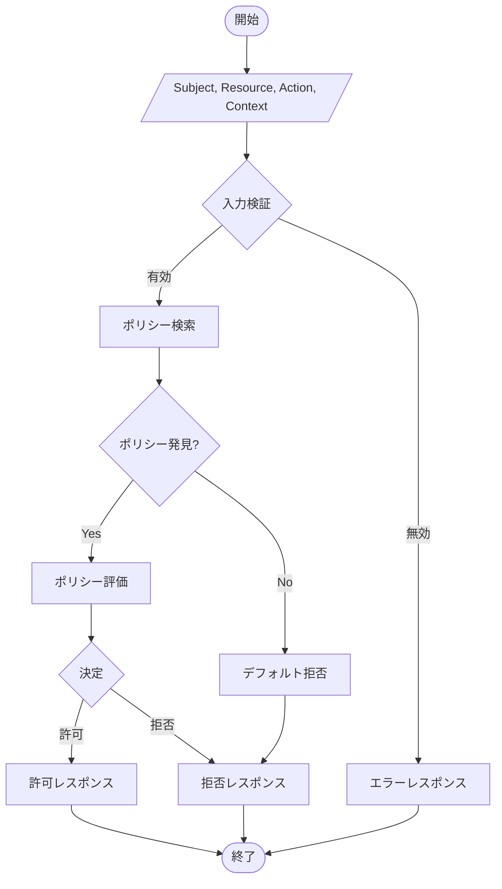

# AuthZEN 情報フロー図

このドキュメントでは、AuthZEN（Authorization API）における情報フローとデータモデルを図で説明します。

## 1. 認可リクエスト・レスポンスの構造

AuthZENの認可リクエストとレスポンスの基本構造を示します。



## 2. 複数認可リクエスト（Evaluations）の構造

複数の認可判断を一度に行うためのリクエスト構造を示します。



## 3. 検索APIのデータフロー

### 3.1 Subject Search



### 3.2 Resource Search



### 3.3 Action Search



## 4. メタデータディスカバリーの構造



## 5. エラーレスポンスの構造



## 6. 認可判断のロジックフロー



## 7. HTTPSバインディングの例

```mermaid
sequenceDiagram
    participant PEP as Policy Enforcement Point
    participant PDP as Policy Decision Point
    
    PEP->>+PDP: POST /access/v1/evaluation HTTP/1.1<br>Host: pdp.example.com<br>Authorization: Bearer token123<br>Content-Type: application/json<br><br>{subject, resource, action, context}
    
    PDP-->>-PEP: HTTP/1.1 200 OK<br>Content-Type: application/json<br><br>{decision: true}
