# AuthZEN セキュリティと実装に関する図

このドキュメントでは、AuthZEN（Authorization API）のセキュリティ面と実装上の考慮事項を図で説明します。

## 1. セキュリティアーキテクチャ

AuthZENのセキュリティアーキテクチャを示します。

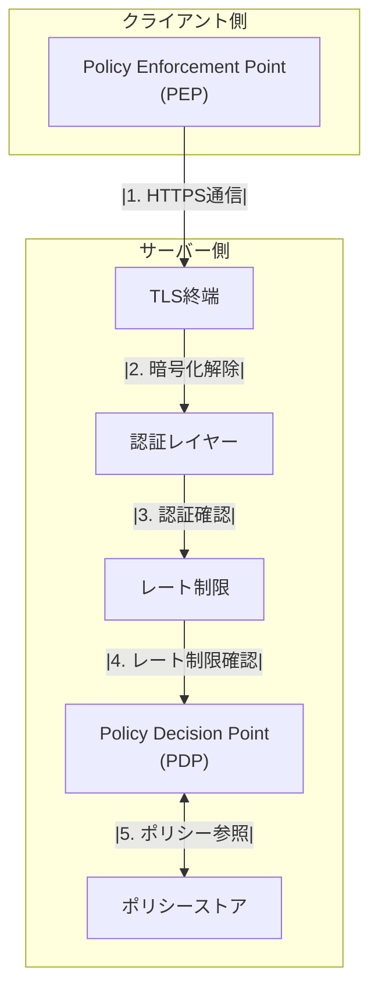

## 2. 認証メカニズム

AuthZENで使用される一般的な認証メカニズムを示します。

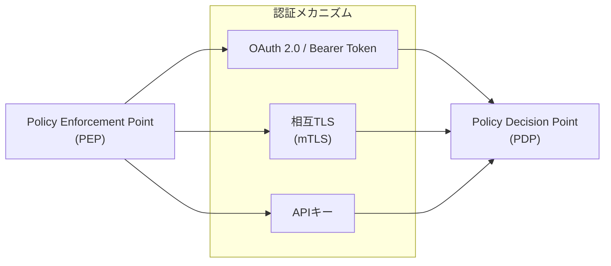

## 3. TLS通信フロー

AuthZENのHTTPSバインディングにおけるTLS通信フローを示します。

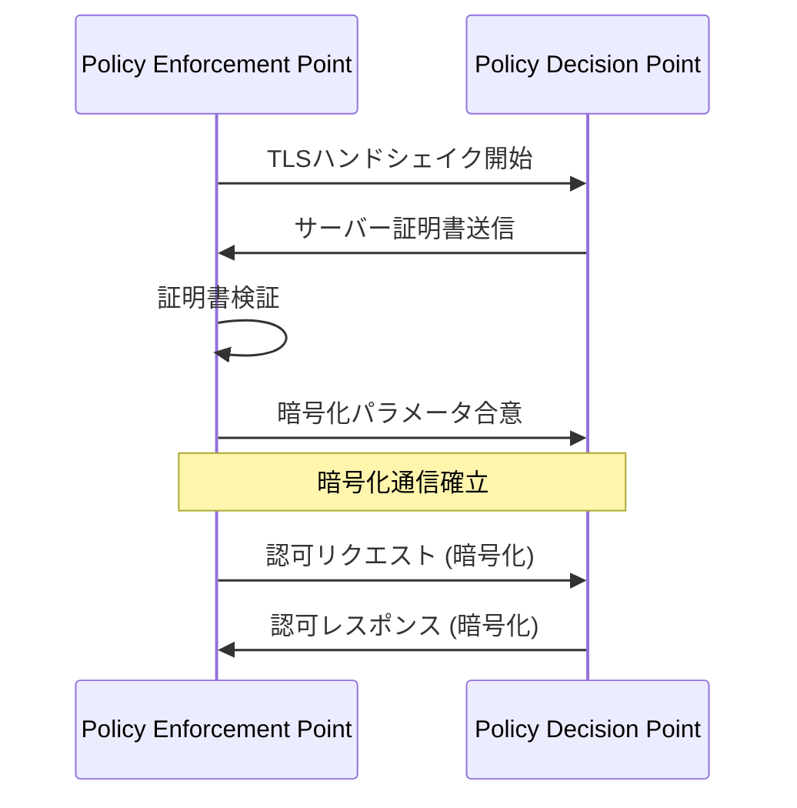

## 4. 相互TLS（mTLS）通信フロー

より高いセキュリティを提供する相互TLS（mTLS）通信フローを示します。

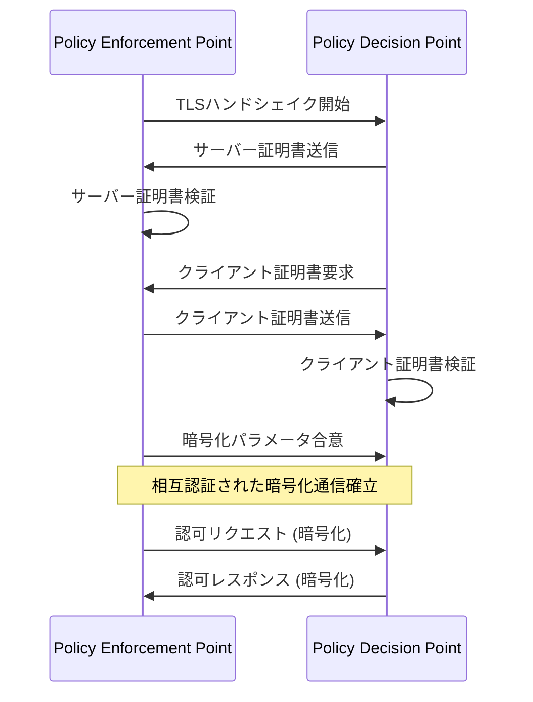

## 5. OAuth 2.0認証フロー

AuthZENでよく使用されるOAuth 2.0クライアント認証フローを示します。

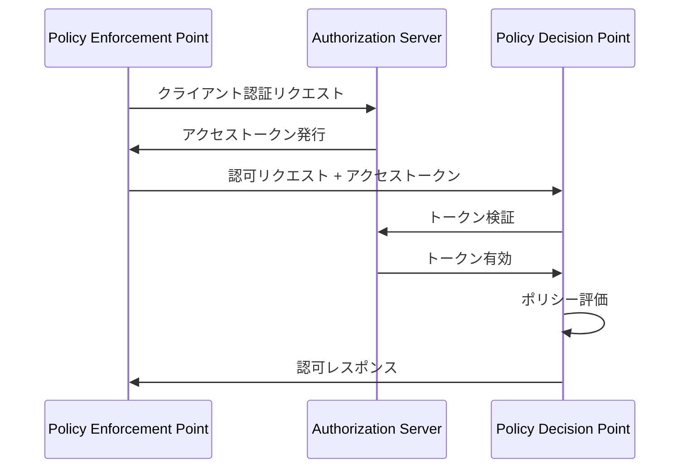

## 6. レート制限の実装

DoS攻撃からの保護のためのレート制限の実装を示します。

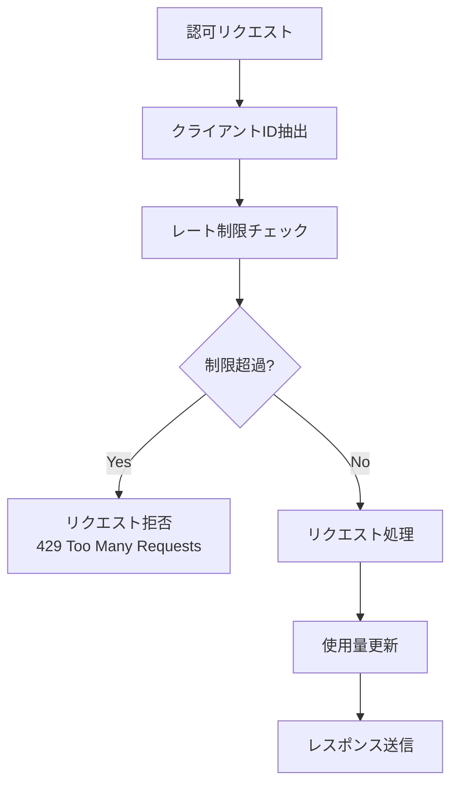

## 7. キャッシング戦略

パフォーマンス向上のためのキャッシング戦略を示します。

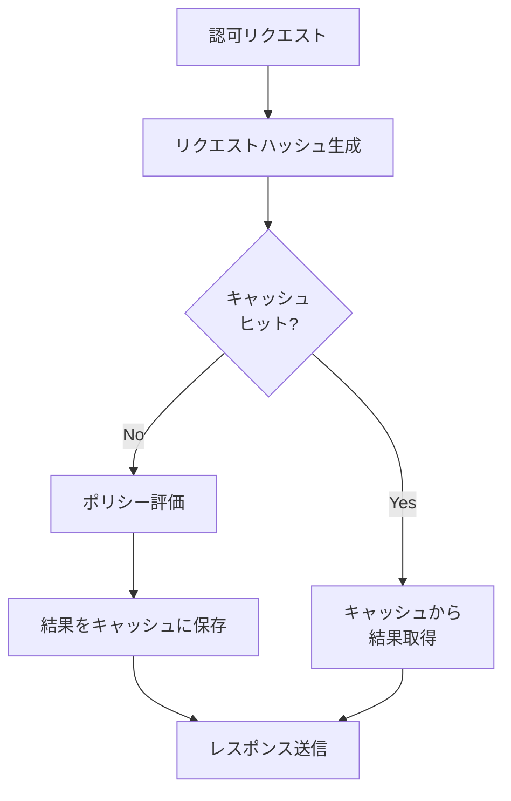

## 8. エラーハンドリングフロー

AuthZENのエラーハンドリングフローを示します。

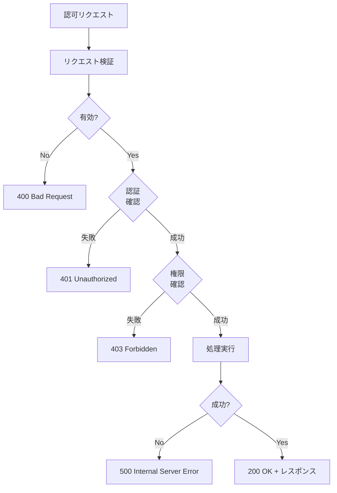

## 9. ポリシーストアの実装オプション

AuthZENのポリシーストアの実装オプションを示します。

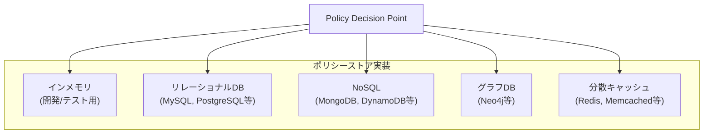

## 10. 監査ログの実装

セキュリティ監査のための監査ログの実装を示します。

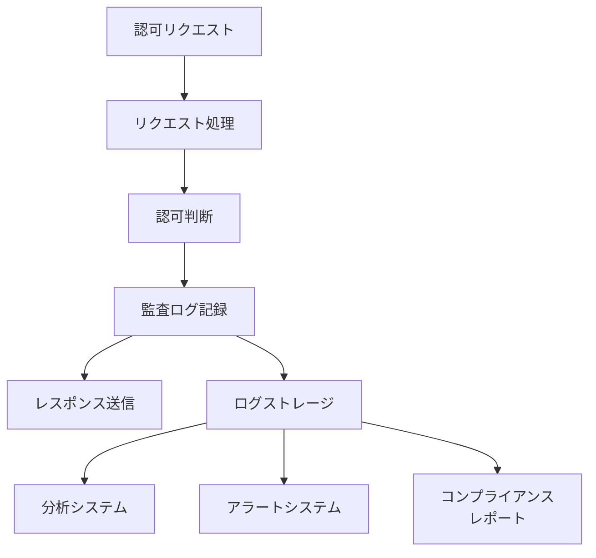

## 11. 高可用性アーキテクチャ

AuthZENの高可用性アーキテクチャを示します。

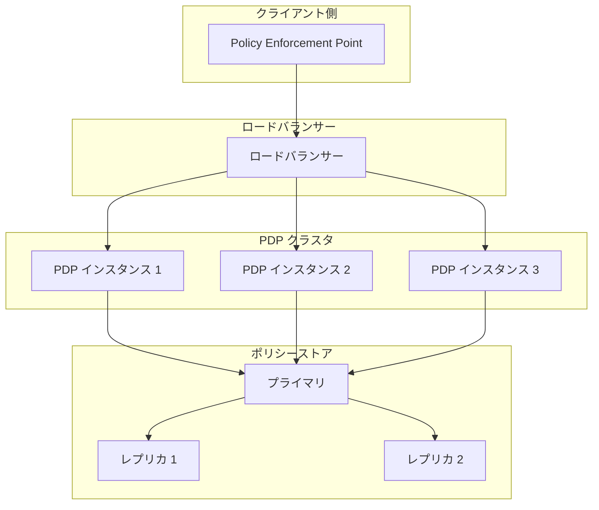
