# AuthZEN 実装ガイド

このドキュメントでは、AuthZEN（Authorization API）を実装する際のパターンとベストプラクティスについて説明します。

## 目次

1. [アーキテクチャパターン](#アーキテクチャパターン)
2. [実装パターン](#実装パターン)
3. [セキュリティベストプラクティス](#セキュリティベストプラクティス)
4. [パフォーマンス最適化](#パフォーマンス最適化)
5. [スケーラビリティ考慮事項](#スケーラビリティ考慮事項)
6. [デプロイメントパターン](#デプロイメントパターン)
7. [テストと検証](#テストと検証)
8. [運用と監視](#運用と監視)

## アーキテクチャパターン

### 集中型PDP

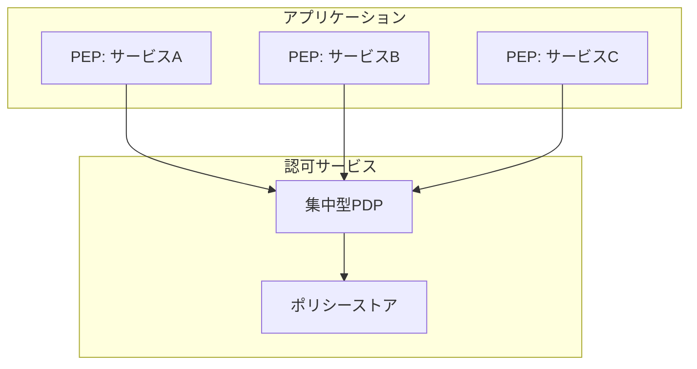

**利点**:
- ポリシーの一元管理
- 一貫した認可ロジック
- ポリシー変更の即時反映

**欠点**:
- 単一障害点
- レイテンシの増加
- スケーラビリティの課題

### 分散型PDP

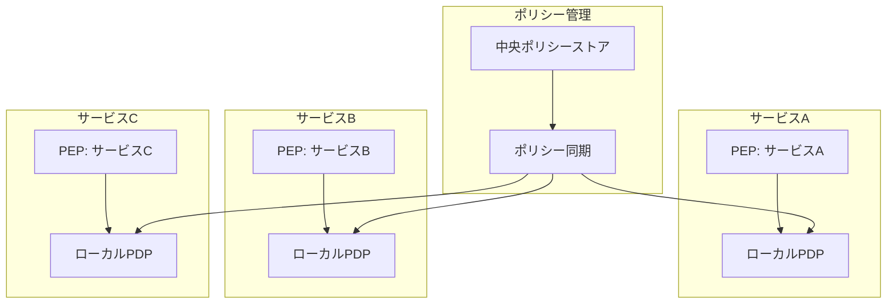

**利点**:
- 低レイテンシ
- 高可用性
- スケーラビリティの向上

**欠点**:
- ポリシー同期の複雑さ
- 一時的な不整合の可能性
- 実装の複雑さ

### ハイブリッドアプローチ

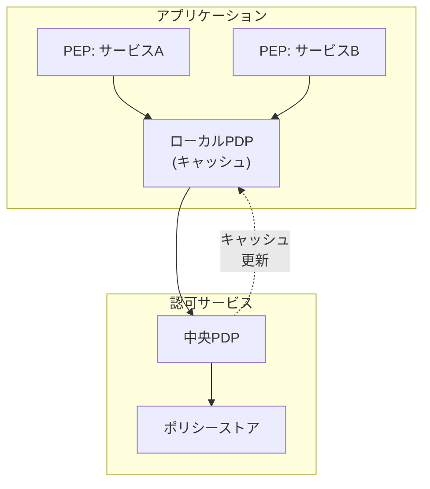

**利点**:
- 低レイテンシと一貫性のバランス
- 障害耐性の向上
- スケーラビリティの向上

**欠点**:
- 実装の複雑さ
- キャッシュ無効化の課題
- 一時的な不整合の可能性

## 実装パターン

### PEP実装パターン

#### デコレータパターン

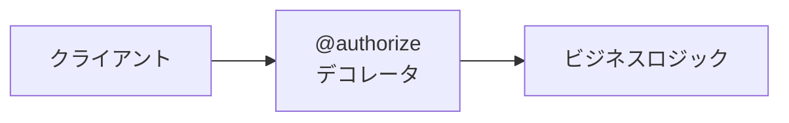

```python
@authorize(resource_type="document", action="read")
def get_document(document_id):
    # ビジネスロジック
    return document
```

#### ミドルウェアパターン

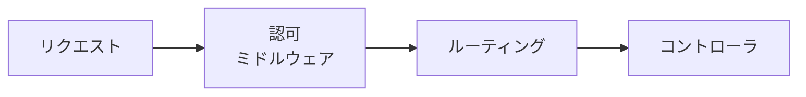

```javascript
app.use('/documents/:id', authorizeMiddleware('document', 'read'), documentsController.get);
```

#### ゲートウェイパターン

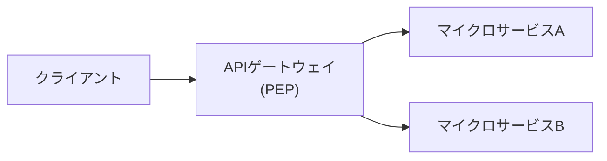

### PDP実装パターン

#### ルールベースPDP

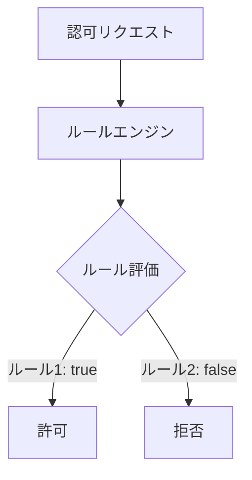

#### ポリシーベースPDP

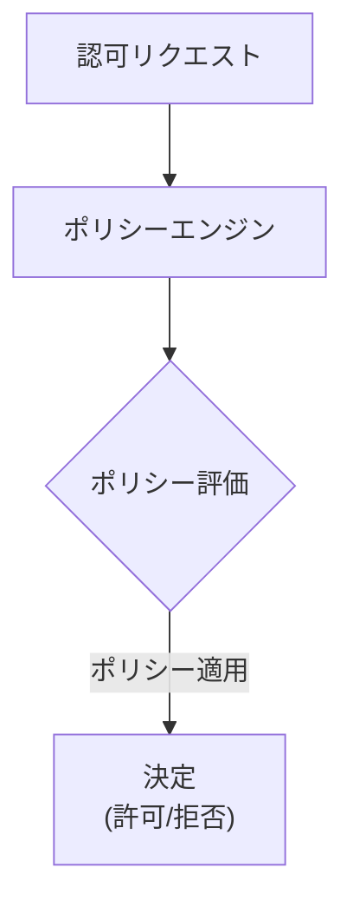

#### グラフベースPDP

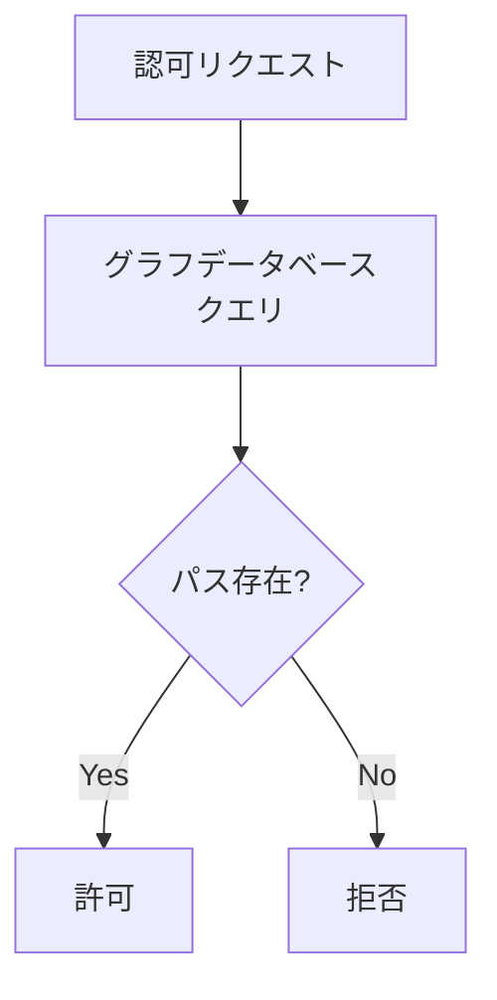

## セキュリティベストプラクティス

### 通信セキュリティ

1. **TLSの使用**: PDPとPEP間の通信は常にTLS 1.2以上を使用して保護する
2. **証明書検証**: 適切な証明書検証を実施し、中間者攻撃を防止する
3. **強力な暗号スイート**: 最新の強力な暗号スイートを使用する

### 認証と認可

1. **相互認証**: PDPとPEP間の相互認証を実装する（mTLSなど）
2. **OAuth 2.0/OpenID Connect**: 標準的な認証プロトコルを使用する
3. **最小権限の原則**: 必要最小限の権限のみを付与する

### データ保護

1. **機密データの最小化**: リクエストとレスポンスに含める機密データを最小限に抑える
2. **データの検証**: すべての入力データを検証し、インジェクション攻撃を防止する
3. **監査ログ**: すべての認可判断を記録し、監査証跡を維持する

### DoS対策

1. **レート制限**: クライアントごとにリクエスト数を制限する
2. **リクエストサイズ制限**: リクエストペイロードのサイズを制限する
3. **タイムアウト**: 長時間実行されるリクエストにタイムアウトを設定する

## パフォーマンス最適化

### キャッシング戦略

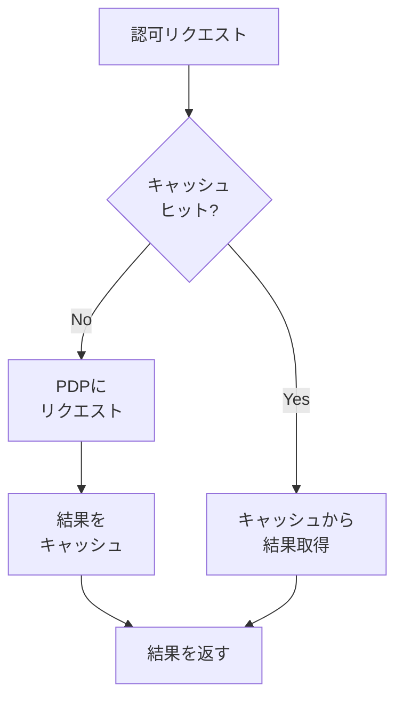

1. **ローカルキャッシュ**: 頻繁に使用される決定をローカルにキャッシュする
2. **分散キャッシュ**: 複数のPEPインスタンス間で決定を共有する
3. **キャッシュ無効化**: ポリシー変更時にキャッシュを無効化する

### バッチ処理

1. **Access Evaluations API**: 複数の認可判断を一度にリクエストする
2. **評価セマンティクス**: 適切な評価セマンティクスを選択する
   - `execute_all`: すべての評価を実行
   - `deny_on_first_deny`: 最初の拒否で停止
   - `permit_on_first_permit`: 最初の許可で停止

### 非同期処理

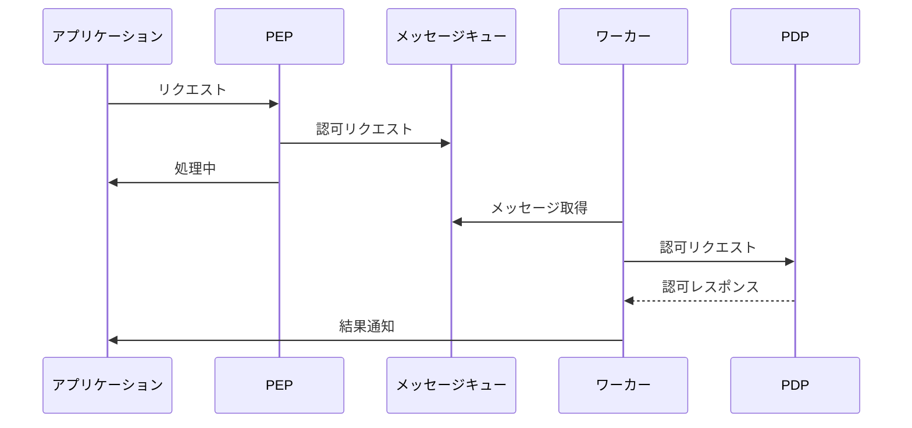

## スケーラビリティ考慮事項

### 水平スケーリング

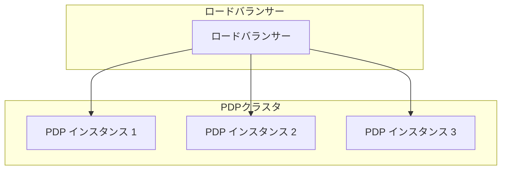

1. **ステートレス設計**: PDPをステートレスに設計し、水平スケーリングを容易にする
2. **ロードバランシング**: 複数のPDPインスタンス間でリクエストを分散する
3. **自動スケーリング**: 負荷に応じてPDPインスタンスを自動的にスケールする

### データパーティショニング

1. **シャーディング**: ポリシーデータを複数のパーティションに分割し、スケーラビリティを向上させる
2. **テナントベースのパーティショニング**: マルチテナント環境では、テナントごとにデータをパーティショニングする
3. **レプリケーション**: 読み取り性能を向上させるために、データを複数のレプリカに複製する

### キャパシティプランニング

1. **負荷テスト**: 様々な負荷条件下でのシステムのパフォーマンスを測定する
2. **リソース見積もり**: 予想されるリクエスト数に基づいて必要なリソースを見積もる
3. **スケーリング計画**: 将来の成長に対応するためのスケーリング計画を策定する

## デプロイメントパターン

### コンテナベースデプロイメント

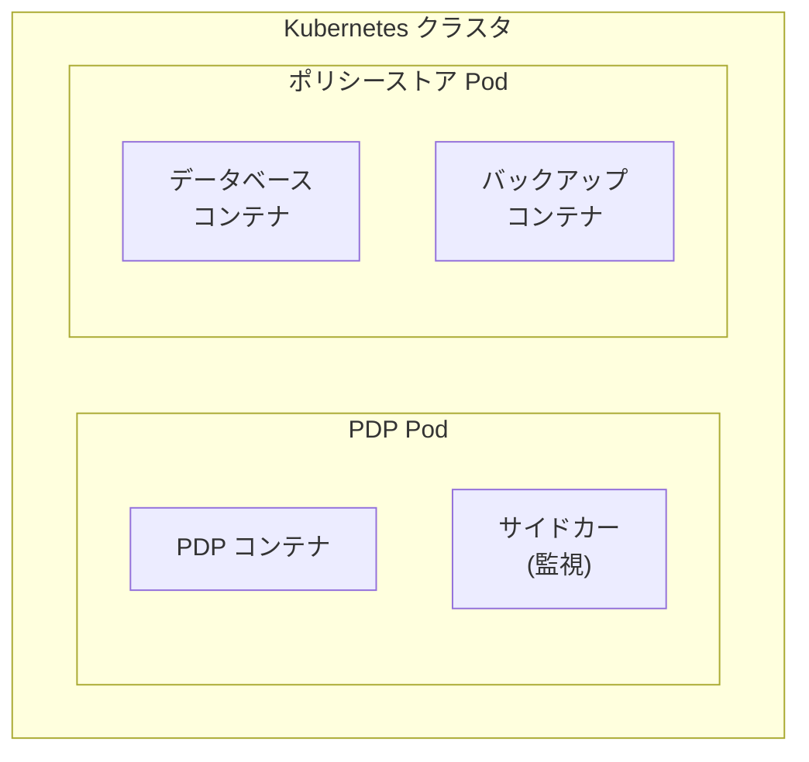

1. **コンテナ化**: PDPをコンテナ化し、Docker、Kubernetes、OpenShiftなどのプラットフォームにデプロイする
2. **オーケストレーション**: Kubernetesなどのオーケストレーションツールを使用して、PDPのデプロイメントを管理する
3. **サービスメッシュ**: Istioなどのサービスメッシュを使用して、PDPの通信を管理する

### サーバーレスデプロイメント

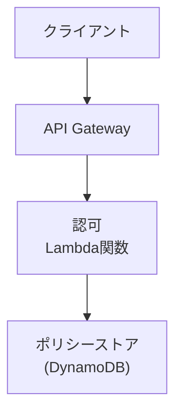

1. **FaaS**: AWS Lambda、Azure Functions、Google Cloud Functionsなどのサーバーレスプラットフォームを使用する
2. **マネージドサービス**: マネージドデータベースサービスを使用してポリシーを保存する
3. **イベント駆動**: イベント駆動アーキテクチャを使用して、ポリシー変更を処理する

### ハイブリッドクラウド

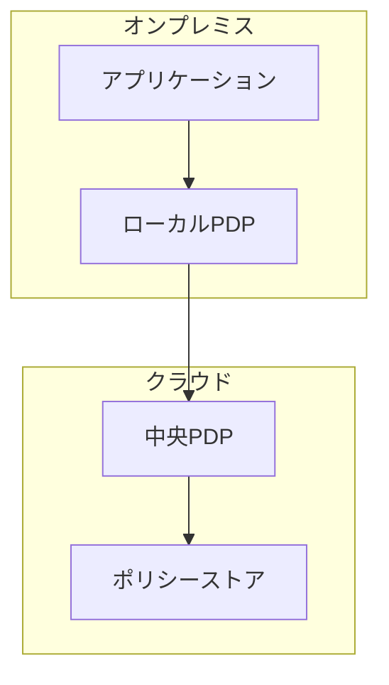

1. **マルチクラウド**: 複数のクラウドプロバイダーにまたがるデプロイメント
2. **ハイブリッド**: オンプレミスとクラウドの両方にまたがるデプロイメント
3. **フェイルオーバー**: 障害時に別のデプロイメントにフェイルオーバーする機能

## テストと検証

### 単体テスト

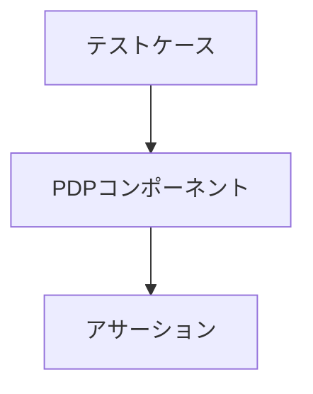

1. **ポリシーテスト**: 個々のポリシーの正確性をテストする
2. **モック**: 外部依存関係をモックしてテストを簡素化する
3. **カバレッジ**: テストカバレッジを測定し、十分なテストを確保する

### 統合テスト

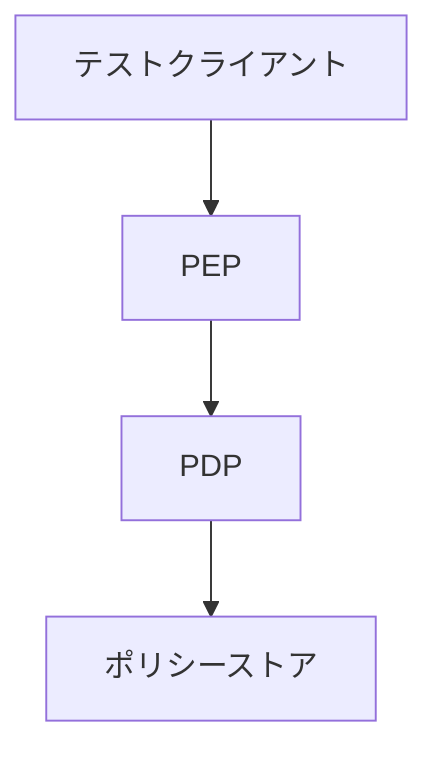

1. **エンドツーエンドテスト**: 実際のシステムコンポーネントを使用してテストする
2. **シナリオテスト**: 実際のユースケースに基づいたシナリオをテストする
3. **境界値テスト**: エッジケースと境界条件をテストする

### 負荷テスト

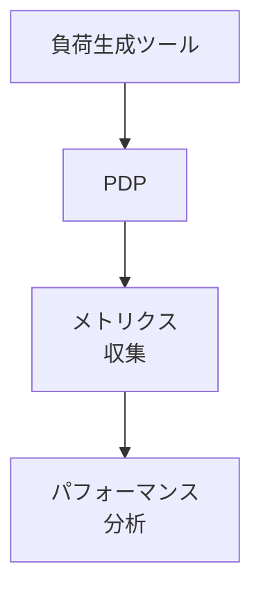

1. **スループットテスト**: システムの最大スループットを測定する
2. **レイテンシテスト**: 様々な負荷条件下でのレイテンシを測定する
3. **耐久性テスト**: 長時間の負荷下でのシステムの安定性をテストする

## 運用と監視

### メトリクス収集

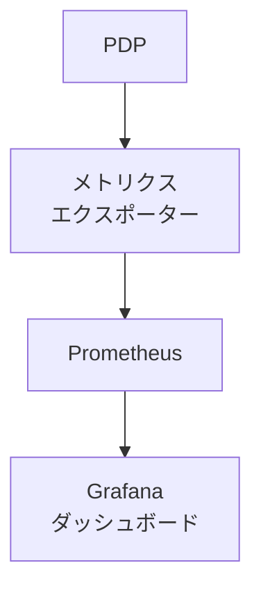

1. **パフォーマンスメトリクス**: レイテンシ、スループット、エラー率などのメトリクスを収集する
2. **リソースメトリクス**: CPU、メモリ、ディスク使用量などのリソースメトリクスを収集する
3. **ビジネスメトリクス**: 認可決定の分布、ポリシー使用状況などのビジネスメトリクスを収集する

### ログ管理

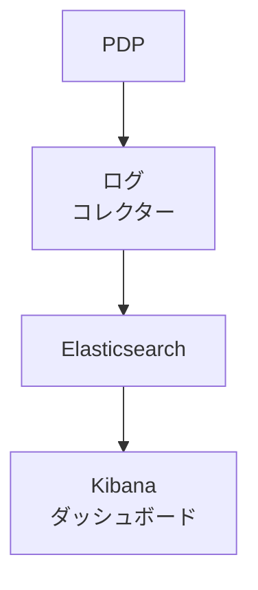

1. **構造化ログ**: JSON形式などの構造化ログを使用する
2. **ログ集約**: 複数のインスタンスからのログを集約する
3. **ログ分析**: ログを分析して、問題を特定する

### アラート

```mermaid
graph TD
    A["メトリクス"] --> B["アラート\nルール"]
    B --> C{"しきい値\n超過?"}
    C -->|"Yes"| D["通知\n(Slack, Email)"]
    C -->|"No"| E["正常"]
```

1. **しきい値アラート**: メトリクスがしきい値を超えた場合にアラートを発生させる
2. **異常検出**: 機械学習を使用して異常を検出し、アラートを発生させる
3. **エスカレーション**: アラートをエスカレーションするプロセスを定義する

## まとめ

AuthZENの実装には、様々なアーキテクチャパターン、実装パターン、セキュリティベストプラクティス、パフォーマンス最適化、スケーラビリティ考慮事項、デプロイメントパターン、テストと検証、運用と監視が関わります。これらの要素を適切に組み合わせることで、堅牢で効率的な認可システムを構築することができます。

このガイドで紹介したパターンとベストプラクティスは、特定のユースケースや要件に応じて適用する必要があります。すべての環境に適した単一のアプローチはなく、各組織は自身の要件に最も適したアプローチを選択する必要があります。
