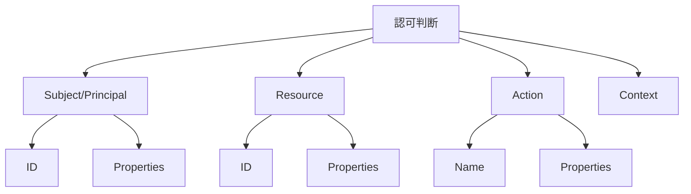

# AuthZEN 情報モデル詳細

このドキュメントでは、AuthZEN（Authorization API）の情報モデルについて詳細に説明します。

## 情報モデルの概要

AuthZENの情報モデルは、認可判断に必要な情報を構造化するためのフレームワークを提供します。このモデルは以下の主要コンポーネントで構成されています：



## Subject（主体）

Subjectは、認可判断の対象となるユーザーや機械プリンシパルを表します。

### 構造

```json
{
  "type": "string",
  "id": "string",
  "properties": {
    "key1": "value1",
    "key2": "value2",
    ...
  }
}
```

### 属性

- `type`: **必須**。主体の種類を指定する文字列値。例えば、"user"、"service"、"group"など。
- `id`: **必須**。`type`の範囲内で一意の主体識別子を含む文字列値。例えば、"alice@acmecorp.com"、"service-123"など。
- `properties`: **オプション**。主体の追加プロパティを表すJSONオブジェクト。

### 例

```json
{
  "type": "user",
  "id": "alice@acmecorp.com",
  "properties": {
    "department": "Sales",
    "role": "Manager",
    "ip_address": "172.217.22.14",
    "device_id": "8:65:ee:17:7e:0b"
  }
}
```

### 共通プロパティ

相互運用性を高めるために、以下の共通プロパティが定義されています：

#### IPアドレス

Subjectの IPアドレスは、`ip_address`フィールドで識別され、その値はRFC4001で定義されているIPアドレスのテキスト表現です。

例：
```json
"properties": {
  "ip_address": "172.217.22.14"
}
```

#### デバイスID

SubjectのデバイスIDは、`device_id`フィールドで識別され、その値はデバイス識別子の文字列表現です。

例：
```json
"properties": {
  "device_id": "8:65:ee:17:7e:0b"
}
```

## Resource（リソース）

Resourceは、アクセスの対象となるリソースを表します。

### 構造

```json
{
  "type": "string",
  "id": "string",
  "properties": {
    "key1": "value1",
    "key2": "value2",
    ...
  }
}
```

### 属性

- `type`: **必須**。リソースの種類を指定する文字列値。例えば、"document"、"account"、"project"など。
- `id`: **必須**。`type`の範囲内で一意のリソース識別子を含む文字列値。例えば、"123"、"project-456"など。
- `properties`: **オプション**。リソースの追加プロパティを表すJSONオブジェクト。

### 例

単純な例：
```json
{
  "type": "document",
  "id": "123"
}
```

構造化されたプロパティを持つ例：
```json
{
  "type": "document",
  "id": "123",
  "properties": {
    "title": "四半期レポート",
    "owner": "alice@acmecorp.com",
    "created_at": "2024-01-15T12:00:00Z",
    "tags": ["財務", "機密"]
  }
}
```

## Action（アクション）

Actionは、Subjectが実行しようとしている操作を表します。

### 構造

```json
{
  "name": "string",
  "properties": {
    "key1": "value1",
    "key2": "value2",
    ...
  }
}
```

### 属性

- `name`: **必須**。アクションの名前を指定する文字列値。例えば、"read"、"write"、"delete"など。
- `properties`: **オプション**。アクションの追加プロパティを表すJSONオブジェクト。

### 例

単純な例：
```json
{
  "name": "read"
}
```

プロパティを持つ例：
```json
{
  "name": "read",
  "properties": {
    "method": "GET",
    "version": "v2"
  }
}
```

## Context（コンテキスト）

Contextは、リクエストに関する環境やコンテキストデータを表します。

### 構造

Contextは任意のJSONオブジェクトとして表現されます。

```json
{
  "key1": "value1",
  "key2": "value2",
  ...
}
```

### 例

```json
{
  "time": "2024-10-26T01:22-07:00",
  "location": "Tokyo",
  "client_ip": "192.168.1.1",
  "user_agent": "Mozilla/5.0 (Windows NT 10.0; Win64; x64) AppleWebKit/537.36 (KHTML, like Gecko) Chrome/91.0.4472.124 Safari/537.36"
}
```

## 決定（Decision）

Decisionは、認可判断の結果を表します。

### 構造

```json
{
  "decision": boolean,
  "context": {
    "key1": "value1",
    "key2": "value2",
    ...
  }
}
```

### 属性

- `decision`: **必須**。認可判断の結果を表すブール値。`true`は許可、`false`は拒否を意味します。
- `context`: **オプション**。決定に関する追加情報を提供するJSONオブジェクト。

### 例

単純な例：
```json
{
  "decision": true
}
```

コンテキスト付きの例：
```json
{
  "decision": false,
  "context": {
    "reason": "リソースへのアクセス権限がありません",
    "policy_id": "P123",
    "required_role": "admin"
  }
}
```

## 理由（Reason）

Reasonは、認可判断の理由を表します。これは通常、`context`フィールド内に含まれます。

### 理由フィールド

理由フィールドは、キーと値が文字列型のJSONオブジェクトです。

例：
```json
{
  "en": "location restriction violation"
}
```

### 理由オブジェクト

理由オブジェクトは、特定の理由を指定するJSONオブジェクトです。

#### 属性

- `id`: **必須**。特定のレスポンスの範囲内で理由を指定する文字列値。
- `reason_admin`: **オプション**。ユーザーと共有してはならないが、管理目的で有用なアクセスが拒否された理由を示す理由フィールドオブジェクト。
- `reason_user`: **オプション**。アクセスが拒否された理由を示す、ユーザーと共有してもよい理由フィールドオブジェクト。

#### 例

```json
{
  "id": "0",
  "reason_admin": {
    "en": "ポリシーC076E82Fに失敗しました"
  },
  "reason_user": {
    "en-403": "権限が不足しています。管理者に連絡してください",
    "ja-403": "権限が不足しています。管理者に連絡してください"
  }
}
```

## 情報モデルの使用例

### 単一の認可判断

```json
// リクエスト
{
  "subject": {
    "type": "user",
    "id": "alice@acmecorp.com",
    "properties": {
      "department": "Sales"
    }
  },
  "resource": {
    "type": "document",
    "id": "123",
    "properties": {
      "owner": "bob@acmecorp.com",
      "classification": "confidential"
    }
  },
  "action": {
    "name": "read"
  },
  "context": {
    "time": "2024-10-26T01:22-07:00",
    "location": "Tokyo"
  }
}

// レスポンス
{
  "decision": true
}
```

### 複数の認可判断

```json
// リクエスト
{
  "subject": {
    "type": "user",
    "id": "alice@acmecorp.com"
  },
  "action": {
    "name": "read"
  },
  "evaluations": [
    {
      "resource": {
        "type": "document",
        "id": "123"
      }
    },
    {
      "resource": {
        "type": "document",
        "id": "456"
      }
    }
  ]
}

// レスポンス
{
  "evaluations": [
    {
      "decision": true
    },
    {
      "decision": false,
      "context": {
        "reason": "リソースへのアクセス権限がありません"
      }
    }
  ]
}
```

## 情報モデルの拡張性

AuthZENの情報モデルは、様々なユースケースに対応できるように設計されています。`properties`フィールドを使用することで、標準的な属性だけでなく、特定のドメインやアプリケーションに固有の属性も表現できます。

例えば、金融アプリケーションでは、以下のような拡張が可能です：

```json
{
  "subject": {
    "type": "user",
    "id": "alice@acmecorp.com",
    "properties": {
      "account_type": "premium",
      "credit_score": 750,
      "risk_level": "low"
    }
  },
  "resource": {
    "type": "transaction",
    "id": "tx-123456",
    "properties": {
      "amount": 5000,
      "currency": "JPY",
      "destination": "bob@acmecorp.com"
    }
  },
  "action": {
    "name": "transfer",
    "properties": {
      "method": "instant"
    }
  },
  "context": {
    "time": "2024-10-26T01:22-07:00",
    "location": "Tokyo",
    "device_trust_score": 0.95
  }
}
```

このように、AuthZENの情報モデルは、基本的な構造を維持しながら、様々なドメインやユースケースに適応できる柔軟性を持っています。
