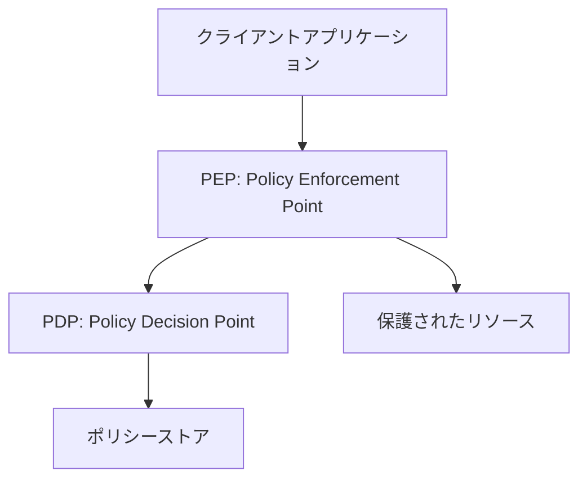

# AuthZEN 概要

## AuthZENとは

AuthZEN（Authorization API）は、Policy Decision Point（PDP）とPolicy Enforcement Point（PEP）間の通信を標準化するための仕様です。この仕様により、異なるシステム間で一貫した認可モデルを提供することが可能になります。

## 主要コンセプト



AuthZENは以下の主要コンセプトに基づいています：

1. **Policy Decision Point (PDP)**: 認可判断を行うコンポーネント
2. **Policy Enforcement Point (PEP)**: PDPから認可判断を受け取り、アクセス制御を実施するコンポーネント
3. **情報モデル**: Subject（主体）、Resource（リソース）、Action（アクション）、Context（コンテキスト）から構成される
4. **API**: 認可判断を行うためのAPI（Access Evaluation API）と検索用API（Search API）

## 情報モデル

AuthZENの情報モデルは以下の要素で構成されています：

### Subject（主体）

ユーザーや機械プリンシパルを表します。以下の属性を持ちます：

- `type`: 主体の種類（例: "user"）
- `id`: 主体の一意識別子
- `properties`: 追加のプロパティ（オプション）

例:
```json
{
  "type": "user",
  "id": "alice@acmecorp.com",
  "properties": {
    "department": "Sales"
  }
}
```

### Resource（リソース）

アクセス対象のリソースを表します。以下の属性を持ちます：

- `type`: リソースの種類（例: "document"）
- `id`: リソースの一意識別子
- `properties`: 追加のプロパティ（オプション）

例:
```json
{
  "type": "document",
  "id": "123",
  "properties": {
    "title": "機密文書"
  }
}
```

### Action（アクション）

実行される操作を表します。以下の属性を持ちます：

- `name`: アクション名（例: "read"）
- `properties`: 追加のプロパティ（オプション）

例:
```json
{
  "name": "read",
  "properties": {
    "method": "GET"
  }
}
```

### Context（コンテキスト）

環境や状況に関する追加情報を表します。任意のJSON形式で表現されます。

例:
```json
{
  "time": "2024-10-26T01:22-07:00",
  "location": "Tokyo"
}
```

## 主要API

AuthZENは以下の主要APIを定義しています：

### 1. Access Evaluation API

単一の認可判断を行うためのAPIです。

**リクエスト例**:
```json
{
  "subject": {
    "type": "user",
    "id": "alice@acmecorp.com"
  },
  "resource": {
    "type": "document",
    "id": "123"
  },
  "action": {
    "name": "read"
  },
  "context": {
    "time": "2024-10-26T01:22-07:00"
  }
}
```

**レスポンス例**:
```json
{
  "decision": true
}
```

### 2. Access Evaluations API

複数の認可判断を一度に行うためのAPIです（バッチ処理）。

**リクエスト例**:
```json
{
  "subject": {
    "type": "user",
    "id": "alice@acmecorp.com"
  },
  "evaluations": [
    {
      "resource": {
        "type": "document",
        "id": "123"
      },
      "action": {
        "name": "read"
      }
    },
    {
      "resource": {
        "type": "document",
        "id": "456"
      },
      "action": {
        "name": "write"
      }
    }
  ]
}
```

**レスポンス例**:
```json
{
  "evaluations": [
    {
      "decision": true
    },
    {
      "decision": false,
      "context": {
        "reason": "権限がありません"
      }
    }
  ]
}
```

### 3. 検索API

#### Subject Search API

特定の条件に一致するSubjectを検索するためのAPIです。

#### Resource Search API

特定の条件に一致するResourceを検索するためのAPIです。

#### Action Search API

特定の条件に一致するActionを検索するためのAPIです。

## トランスポート

AuthZENはHTTPSバインディングを定義しています。エンドポイントは以下の通りです：

- Access Evaluation API: `/access/v1/evaluation`
- Access Evaluations API: `/access/v1/evaluations`
- Subject Search API: `/access/v1/search/subject`
- Resource Search API: `/access/v1/search/resource`
- Action Search API: `/access/v1/search/action`

## メタデータディスカバリー

AuthZENはPDPのメタデータを取得するためのエンドポイントを定義しています。メタデータは以下のURLで取得できます：

```
/.well-known/authzen-configuration
```

メタデータには以下の情報が含まれます：

- `policy_decision_point`: PDPのベースURL
- `access_evaluation_endpoint`: Access Evaluation APIのエンドポイント
- `access_evaluations_endpoint`: Access Evaluations APIのエンドポイント
- `search_subject_endpoint`: Subject Search APIのエンドポイント
- `search_resource_endpoint`: Resource Search APIのエンドポイント
- `search_action_endpoint`: Action Search APIのエンドポイント

## セキュリティ考慮事項

AuthZENを実装する際には、以下のセキュリティ考慮事項に注意する必要があります：

1. **通信の整合性と機密性**: PEPとPDP間の通信はTLSなどで保護する必要があります
2. **ポリシーの機密性と送信者認証**: PDPは呼び出し元のPEPを認証する必要があります
3. **可用性とDoS対策**: リクエストのサイズ、数、無効なJSONなどに対する保護が必要です

## 実装例

このリポジトリには、AuthZEN仕様に準拠したサンプル実装が含まれています。詳細は[サンプルアプリケーション](../src/README.md)を参照してください。
