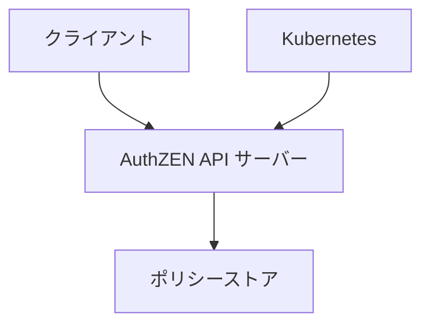

# AuthZEN サンプルアプリケーション

このディレクトリには、AuthZEN（Authorization API）仕様に準拠したサンプル実装が含まれています。このサンプルアプリケーションは、Go言語で実装されており、Kubernetes（Kind）上で動作確認できるように設計されています。

## 概要



このサンプルアプリケーションは、以下のコンポーネントで構成されています：

1. **AuthZEN API サーバー**: AuthZEN仕様に準拠したRESTful APIを提供するサーバー
2. **ポリシーストア**: 認可ポリシーを管理するためのインメモリストア
3. **Kubernetes マニフェスト**: Kubernetes上にデプロイするためのマニフェストファイル

## 機能

このサンプルアプリケーションは、AuthZEN仕様で定義されている以下のAPIをサポートしています：

- **Access Evaluation API**: 単一の認可判断を行うAPI
- **Access Evaluations API**: 複数の認可判断を一度に行うAPI
- **Subject Search API**: 特定の条件に一致するSubjectを検索するAPI
- **Resource Search API**: 特定の条件に一致するResourceを検索するAPI
- **Action Search API**: 特定の条件に一致するActionを検索するAPI
- **メタデータディスカバリー**: PDPのメタデータを取得するためのAPI

## ディレクトリ構造

```
src/
├── api/
│   ├── models.go       # データモデルの定義
│   ├── server.go       # APIサーバーの実装
│   └── handlers.go     # APIハンドラーの実装
├── policy/
│   └── store.go        # ポリシーストアの実装
├── main.go             # メインエントリーポイント
└── README.md           # このファイル
```

## 前提条件

- Go 1.18以上
- Docker
- Kind（Kubernetes in Docker）
- kubectl

## ビルドと実行

### ローカルでの実行

```bash
# ビルド
cd src
go build -o authzen-server

# 実行
./authzen-server
```

デフォルトでは、サーバーはポート8080でリッスンします。ポートを変更するには、`--port`フラグを使用します：

```bash
./authzen-server --port 9000
```

### Dockerイメージのビルド

```bash
cd src
docker build -t authzen-server:latest .
```

### Kindへのデプロイ

```bash
# Kindクラスタの作成（まだ作成していない場合）
kind create cluster --name authzen

# Dockerイメージのビルドとロード
docker build -t authzen-server:latest .
kind load docker-image authzen-server:latest --name authzen

# Kubernetesマニフェストの適用
kubectl apply -f ../kubernetes/
```

## APIの使用例

### Access Evaluation API

```bash
curl -X POST http://localhost:8080/access/v1/evaluation \
  -H "Content-Type: application/json" \
  -d '{
    "subject": {
      "type": "user",
      "id": "alice@example.com"
    },
    "resource": {
      "type": "document",
      "id": "123"
    },
    "action": {
      "name": "read"
    }
  }'
```

### Access Evaluations API

```bash
curl -X POST http://localhost:8080/access/v1/evaluations \
  -H "Content-Type: application/json" \
  -d '{
    "subject": {
      "type": "user",
      "id": "alice@example.com"
    },
    "action": {
      "name": "read"
    },
    "evaluations": [
      {
        "resource": {
          "type": "document",
          "id": "123"
        }
      },
      {
        "resource": {
          "type": "document",
          "id": "456"
        }
      }
    ]
  }'
```

### Subject Search API

```bash
curl -X POST http://localhost:8080/access/v1/search/subject \
  -H "Content-Type: application/json" \
  -d '{
    "subject": {
      "type": "user"
    },
    "action": {
      "name": "read"
    },
    "resource": {
      "type": "document",
      "id": "123"
    }
  }'
```

### メタデータディスカバリー

```bash
curl -X GET http://localhost:8080/.well-known/authzen-configuration
```

## 実装の詳細

### ポリシーストア

このサンプルアプリケーションでは、シンプルなインメモリポリシーストアを使用しています。実際の本番環境では、データベースなどの永続的なストレージを使用することが推奨されます。

ポリシーストアは、以下のような形式でポリシーを管理します：

```go
type Policy struct {
    Subject  string
    Resource string
    Action   string
    Allow    bool
}
```

### 認可ロジック

認可ロジックは、以下のような単純なルールに基づいています：

1. Subject、Resource、Actionの組み合わせに一致するポリシーがある場合、そのポリシーの`Allow`値に基づいて判断します。
2. 一致するポリシーがない場合、デフォルトでは拒否（`false`）します。

### エラーハンドリング

APIは、以下のようなエラーハンドリングを実装しています：

- リクエストボディのパース失敗: 400 Bad Request
- 内部エラー: 500 Internal Server Error

### セキュリティ

このサンプルアプリケーションでは、簡単のために認証は実装していません。実際の本番環境では、OAuth 2.0などの認証メカニズムを実装することが推奨されます。

また、TLS（HTTPS）もデフォルトでは有効になっていませんが、`--tls`フラグと`--cert`、`--key`フラグを使用して有効にすることができます：

```bash
./authzen-server --tls --cert server.crt --key server.key
```

## 拡張と改善

このサンプルアプリケーションは、AuthZEN仕様の基本的な機能を示すために設計されています。実際の本番環境では、以下のような拡張や改善が考えられます：

1. **永続的なポリシーストレージ**: データベースなどを使用して、ポリシーを永続的に保存する
2. **より複雑な認可ロジック**: 属性ベースのアクセス制御（ABAC）や関係ベースのアクセス制御（ReBAC）などの高度な認可モデルをサポートする
3. **キャッシング**: パフォーマンスを向上させるために、認可判断の結果をキャッシュする
4. **監査ログ**: 認可判断の履歴を記録する
5. **管理API**: ポリシーの管理（追加、削除、更新）を行うためのAPIを提供する

## ライセンス

このサンプルアプリケーションは、MITライセンスの下で提供されています。
